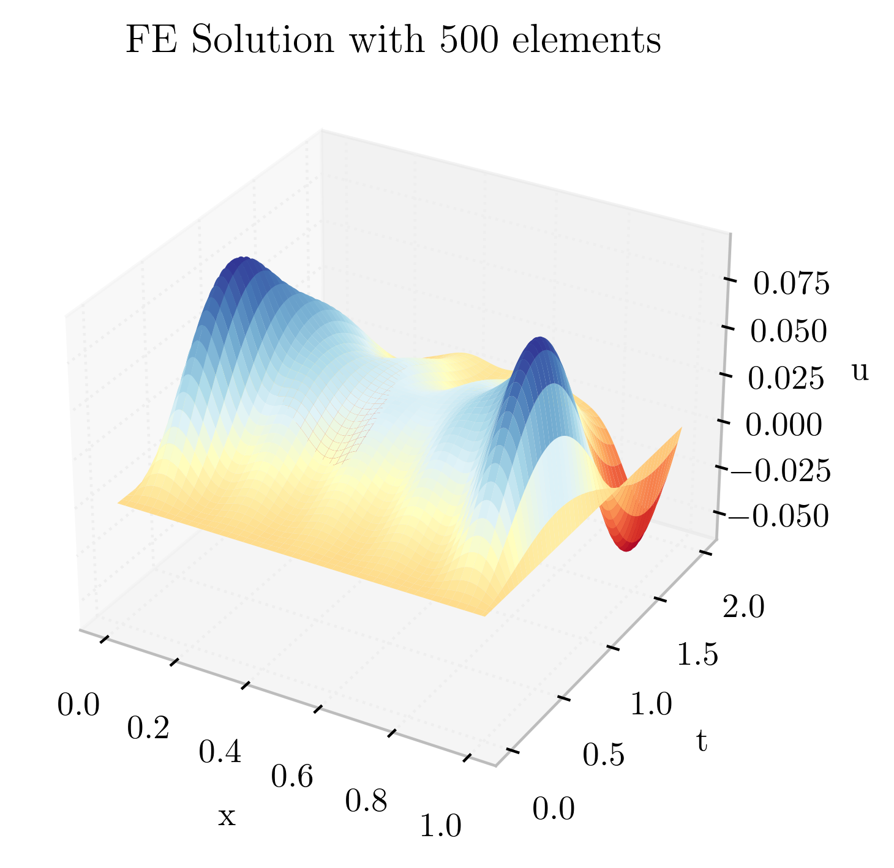

<h1></img>anabel</h1>

An end to end differentiable finite element framework.

-------------------------------------

[![Code Style: Black][black-shield]]()
[![PyPI Version][pypi-v-image]][pypi-v-link]
[](https://claudioperez.github.io/anabel/)
<!-- ![Build status][build-img] -->
<!-- [![Commits since latest release][gh-image]][gh-link] -->
<!-- []() -->

[Foundations](https://claudioperez.github.io/anabel/guides/foundations)

## Installation

The *base* Anabel package can be installed from a terminal with the following command:

```bash
$ pip install anabel
```

This installation includes basic tools for composing "neural network" -like models along with some convenient IO utilities. However, both automatic differentiation and JIT capabilities require Google's Jaxlib module which is currently in early development and only packaged for Ubuntu systems. On Windows systems this can be easily overcome by downloading the Ubuntu terminal emulator from Microsoft's app store and enabling the Windows Subsystem for Linux (WSL). The following extended command will install Anabel along with all necessary dependencies for automatic differentiation and JIT compilation:

```bash
$ pip install anabel[jax]
```

The in-development version can be installed the following command:

```bash
$ pip install https://github.com/claudioperez/anabel/archive/master.zip
```

## Core API - Modeling PDEs 

```python
from anabel import template, diff, MappedMesh
from anabel.interpolate import lagrange_t6

@template(6)
def poisson_template(u,v,iso,f,):
    def poisson(uh,xyz):
        return diff.jacx(u)(u,v)
```

<!--  -->

## Utility Modules

### [`anabel.sections`]()

```python
from anabel.sections import Tee

t_section = Tee(bf=60, tf=6, tw=18, d=24)
t_section.plot()
```


### [`anabel.transient`]()


## Building The Documentation

The following additional dependencies are required to build the project documentation:

- [Pandoc](https://pandoc.org/)
- Elstir (`pip install elstir`)

To build the documentation, run the following command from the project root directory:

```shell
$ elstir build
```

## Organization of Source Code


### Documentation
- [`elstir.yml`]
- [`style/`] Directory holding style/template/theme files for documentation.
- [`docs/api/`] Automatically generated API documentation files.

### Source Code
- [`setup.py`] Installation/setup; used for pip installation.
- [`src/anabel/`] Python source code
- [`lib/`] C++ source code for extension library

### Data
- [`dat/quadrature/`] Quadrature scheme data.

### Source Control, Testing, Continuous Integration
- `.gitignore` Configuration for [Git]() source control.
- [`.appveyor.yml`] configuration file for [Appveyor](https://www.appveyor.com/)
- `.coveragerc` configuration file for [CodeCov](https://codecov.io/), used to measure testing coverage.
- `pytest.ini` configuration file for [PyTest](), used to setup testing.


<!-- Links to project folders -->
[`dat/quadrature/`]: ./dat/quadrature/
[`docs/api/`]: ./docs/api/
[`src/anabel/`]: ./src/anabel/
[`elstir.yml`]: ./elstir.yml
[`style/`]: ./style/
[`setup.py`]: ./setup.py
[`.appveyor.yml`]: ./.appveyor.yml


<!-- Links for badges -->
[black-shield]: https://img.shields.io/badge/code%20style-black-000000.svg

[pypi-v-image]: https://img.shields.io/pypi/v/anabel.svg
[pypi-v-link]: https://pypi.org/project/anabel/

[gh-link]: https://github.com/claudioperez/anabel/compare/0.0.9...master
[gh-image]: https://img.shields.io/github/commits-since/claudioperez/anabel/0.0.9?style=social

[build-img]: https://ci.appveyor.com/api/projects/status/github/claudioperez/anabel?branch=master&svg=true

[](https://app.fossa.com/projects/git%2Bgithub.com%claudioperez%2Fanabel?ref=badge_large)

