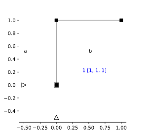

---
title: Problem 2
...

# Problem 2 

(see Ex 9.6)


```python
# Remove
import ema as em
import matplotlib.pyplot as plt
import numpy as np
%config InlineBackend.figure_format = 'svg' # used to make plots look nicer
from ema_examples.dynamics import E09_06
from ema.utilities.ipyutils import disp_sbs 
from scipy.linalg import eig
```


```python
L = 1
mass = 1
EI = 1/12

mdl = E09_06(L=L, m = mass, EI = EI)
fig, ax = plt.subplots()
em.plot_structure(mdl, ax)
mdl.DOF
```


    [[7, 8, 9], [1, 2, 3], [4, 5, 6]]





```python
m, K = em.Mass_matrix(mdl), em.K_matrix(mdl)
m[0,0] = 3.*mass
m[1,1] = 1.*mass
m[2:,2:] = 0*mass
disp_sbs(m.f.df, K.f.df)
```


<table style = "display:inline" border="1" class="dataframe">
  <thead>
    <tr style="text-align: right;">
      <th></th>
      <th>$u_{{1}}$</th>
      <th>$u_{{2}}$</th>
      <th>$u_{{3}}$</th>
      <th>$u_{{4}}$</th>
      <th>$u_{{5}}$</th>
      <th>$u_{{6}}$</th>
    </tr>
  </thead>
  <tbody>
    <tr>
      <th>$u_{{1}}$</th>
      <td>3.0</td>
      <td>0.0</td>
      <td>0.0</td>
      <td>0.0</td>
      <td>0.0</td>
      <td>0.0</td>
    </tr>
    <tr>
      <th>$u_{{2}}$</th>
      <td>0.0</td>
      <td>1.0</td>
      <td>0.0</td>
      <td>0.0</td>
      <td>0.0</td>
      <td>0.0</td>
    </tr>
    <tr>
      <th>$u_{{3}}$</th>
      <td>0.0</td>
      <td>0.0</td>
      <td>0.0</td>
      <td>0.0</td>
      <td>0.0</td>
      <td>0.0</td>
    </tr>
    <tr>
      <th>$u_{{4}}$</th>
      <td>0.0</td>
      <td>0.0</td>
      <td>0.0</td>
      <td>0.0</td>
      <td>0.0</td>
      <td>0.0</td>
    </tr>
    <tr>
      <th>$u_{{5}}$</th>
      <td>0.0</td>
      <td>0.0</td>
      <td>0.0</td>
      <td>0.0</td>
      <td>0.0</td>
      <td>0.0</td>
    </tr>
    <tr>
      <th>$u_{{6}}$</th>
      <td>0.0</td>
      <td>0.0</td>
      <td>0.0</td>
      <td>0.0</td>
      <td>0.0</td>
      <td>0.0</td>
    </tr>
  </tbody>
</table style = "display:inline"><table style = "display:inline" border="1" class="dataframe">
  <thead>
    <tr style="text-align: right;">
      <th></th>
      <th>$1$</th>
      <th>$2$</th>
      <th>$3$</th>
      <th>$4$</th>
      <th>$5$</th>
      <th>$6$</th>
    </tr>
  </thead>
  <tbody>
    <tr>
      <th>$P_{1}$</th>
      <td>8334.333333</td>
      <td>0.000000</td>
      <td>0.500000</td>
      <td>-8333.333333</td>
      <td>0.0</td>
      <td>0.000000</td>
    </tr>
    <tr>
      <th>$P_{2}$</th>
      <td>0.000000</td>
      <td>8334.333333</td>
      <td>0.500000</td>
      <td>0.000000</td>
      <td>-1.0</td>
      <td>0.500000</td>
    </tr>
    <tr>
      <th>$P_{3}$</th>
      <td>0.500000</td>
      <td>0.500000</td>
      <td>0.666667</td>
      <td>0.000000</td>
      <td>-0.5</td>
      <td>0.166667</td>
    </tr>
    <tr>
      <th>$P_{4}$</th>
      <td>-8333.333333</td>
      <td>0.000000</td>
      <td>0.000000</td>
      <td>8333.333333</td>
      <td>0.0</td>
      <td>0.000000</td>
    </tr>
    <tr>
      <th>$P_{5}$</th>
      <td>0.000000</td>
      <td>-1.000000</td>
      <td>-0.500000</td>
      <td>0.000000</td>
      <td>1.0</td>
      <td>-0.500000</td>
    </tr>
    <tr>
      <th>$P_{6}$</th>
      <td>0.000000</td>
      <td>0.500000</td>
      <td>0.166667</td>
      <td>0.000000</td>
      <td>-0.5</td>
      <td>0.333333</td>
    </tr>
  </tbody>
</table style = "display:inline">


```python
# k, m = em.analysis.StaticCondensation(k.f, m.f, idxs=[3,4])
k = em.analysis.kStaticCondensation(K.f, idxs=[3,4])
# disp_sbs(k.df)
k
```


<table border="1" class="dataframe">
  <thead>
    <tr style="text-align: right;">
      <th></th>
      <th>$4$</th>
      <th>$5$</th>
    </tr>
  </thead>
  <tbody>
    <tr>
      <th>$4$</th>
      <td>0.571384</td>
      <td>0.214267</td>
    </tr>
    <tr>
      <th>$5$</th>
      <td>0.214267</td>
      <td>0.142849</td>
    </tr>
  </tbody>
</table>


```python
m = m[0:2,0:2]
freq2, Phi = eig(m, k)
Phi/0.57293852
```


    array([[-1.        , -0.75123369],
           [-1.4305171 ,  1.57544505]])


```python
M = Phi.T@m@Phi
K = Phi.T@k@Phi
M
```


    Structural_Vector([[ 1.65651710e+00, -1.11022302e-16],
                       [ 0.00000000e+00,  1.37050677e+00]])


## a) Modal expansion of earthquake forces

$$\mathrm{p}_{\mathrm{eff}}(t)=-\mathrm{m} \iota \ddot{u}_{g}(t)$$

$$\mathbf{m} \iota=\sum_{n=1}^{N} \mathbf{s}_{n}=\sum_{n=1}^{N} \Gamma_{n} \mathbf{m} \phi_{n}$$


```python
I = N = 2
iota = np.array([0, 1])
Ln = np.array([sum(Phi.T[n,i]*sum(m[i,j]*iota[j] for j in range(I)) for i in range(I)) for n in range(N)])
Ln = Phi.T@m@iota
Ln
```


    Structural_Vector([-0.81959835,  0.90263316])


```python
gamma = np.array([Ln[n]/M[n,n] for n in range(N)])
gamma
```


    array([-0.49477204,  0.65861269])


```python
sn = [gamma[n]*(m@Phi[:,n]) for n in range(N)]
sn
```


    [Structural_Vector([0.85042189, 0.40551435]),
     Structural_Vector([-0.85042189,  0.59448565])]


