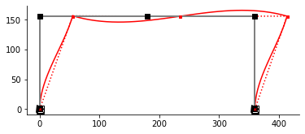

---
jupyter:
  kernelspec:
    display_name: Python 3
    language: python
    name: python3
  language_info:
    codemirror_mode:
      name: ipython
      version: 3
    file_extension: .py
    mimetype: text/x-python
    name: python
    nbconvert_exporter: python
    pygments_lexer: ipython3
    version: 3.8.8
  nbformat: 4
  nbformat_minor: 4
---

[{style="margin:auto; display: block; max-width: 75%"}](https://github.com/claudioperez/elle-0002/compare/v0.0.0...master)

``` {.python}
import anon
#anon.conf.config.update('jax_disable_jit', True)
import elle.sections
import emme as em
```

``` {.python}
# column_section = em.aisc.load("w14x159")
# girder_section = em.aisc.load("w33x130")
column_section = {"A": 576.0, "I": 27_648.0}
girder_section = {"A": 684.0, "I": 34_383.8}
```

``` {.python}
# Create a model Assembler
model = em.SkeletalModel(ndm=2,ndf=3)
```

``` {.python}
# Set up nodes
E = 3.6e3
ft = 12
B, H = 30.*ft, 13.*ft
model.node("1",  0.,  0.)
model.node("2",  0.,  H )
model.node("3", B/2,  H )
model.node("4",  B ,  H )
model.node("5",  B ,  0.)

model.beam("a", "1", "2", **column_section,E=E)
model.beam("b", "2", "3", **girder_section,E=E)
model.beam("c", "3", "4", **girder_section,E=E)
model.beam("d", "4", "5", **column_section,E=E)

model.boun("1", [1,1,1]) 
model.boun("5", [1,1,1])

model.load("2", 20.0, dof="x")

em.plot_structure(model);
```

{style="margin:auto; display: block; max-width: 75%"}

``` {.python}
f = model.compose()
```

    WARNING:absl:No GPU/TPU found, falling back to CPU. (Set TF_CPP_MIN_LOG_LEVEL=0 and rerun for more info.)

``` {.python}
U = f()
U
```

    DeviceArray([[ 0.0551163 ],
                 [ 0.00024871],
                 [-0.00029532],
                 [ 0.05439212],
                 [-0.00049367],
                 [ 0.00014284],
                 [ 0.05366794],
                 [-0.00024871],
                 [-0.00028435]], dtype=float64)

``` {.python}
fig, ax = em.plot_displ(model, U, scale=1e3)
```

{style="margin:auto; display: block; max-width: 75%"}

``` {.python}
model.delems["a"].ke_matrix()
```

```{=html}
<table border="1" class="dataframe">
  <thead>
    <tr style="text-align: right;">
      <th></th>
      <th>$u_10$</th>
      <th>$u_11$</th>
      <th>$u_12$</th>
      <th>$u_1$</th>
      <th>$u_2$</th>
      <th>$u_3$</th>
    </tr>
  </thead>
  <tbody>
    <tr>
      <th>$u_10$</th>
      <td>314.61083</td>
      <td>0.00000</td>
      <td>-2.453964e+04</td>
      <td>-314.61083</td>
      <td>0.00000</td>
      <td>-2.453964e+04</td>
    </tr>
    <tr>
      <th>$u_11$</th>
      <td>0.00000</td>
      <td>13292.30769</td>
      <td>0.000000e+00</td>
      <td>0.00000</td>
      <td>-13292.30769</td>
      <td>0.000000e+00</td>
    </tr>
    <tr>
      <th>$u_12$</th>
      <td>-24539.64497</td>
      <td>0.00000</td>
      <td>2.552123e+06</td>
      <td>24539.64497</td>
      <td>0.00000</td>
      <td>1.276062e+06</td>
    </tr>
    <tr>
      <th>$u_1$</th>
      <td>-314.61083</td>
      <td>0.00000</td>
      <td>2.453964e+04</td>
      <td>314.61083</td>
      <td>0.00000</td>
      <td>2.453964e+04</td>
    </tr>
    <tr>
      <th>$u_2$</th>
      <td>0.00000</td>
      <td>-13292.30769</td>
      <td>0.000000e+00</td>
      <td>0.00000</td>
      <td>13292.30769</td>
      <td>0.000000e+00</td>
    </tr>
    <tr>
      <th>$u_3$</th>
      <td>-24539.64497</td>
      <td>0.00000</td>
      <td>1.276062e+06</td>
      <td>24539.64497</td>
      <td>0.00000</td>
      <td>2.552123e+06</td>
    </tr>
  </tbody>
</table>
```

``` {.python}
em.K_matrix(model)
```

```{=html}
<table border="1" class="dataframe">
  <thead>
    <tr style="text-align: right;">
      <th></th>
      <th>$1$</th>
      <th>$2$</th>
      <th>$3$</th>
      <th>$4$</th>
      <th>$5$</th>
      <th>$6$</th>
      <th>$7$</th>
      <th>$8$</th>
      <th>$9$</th>
      <th>$10$</th>
      <th>$11$</th>
      <th>$12$</th>
      <th>$13$</th>
      <th>$14$</th>
      <th>$15$</th>
    </tr>
  </thead>
  <tbody>
    <tr>
      <th>$P_{1}$</th>
      <td>13994.61083</td>
      <td>0.00000</td>
      <td>2.453964e+04</td>
      <td>-13680.0</td>
      <td>0.00000</td>
      <td>0.000000e+00</td>
      <td>0.00000</td>
      <td>0.00000</td>
      <td>0.000000e+00</td>
      <td>-314.61083</td>
      <td>0.00000</td>
      <td>2.453964e+04</td>
      <td>0.00000</td>
      <td>0.00000</td>
      <td>0.000000e+00</td>
    </tr>
    <tr>
      <th>$P_{2}$</th>
      <td>0.00000</td>
      <td>13547.00251</td>
      <td>2.292253e+04</td>
      <td>0.0</td>
      <td>-254.69481</td>
      <td>2.292253e+04</td>
      <td>0.00000</td>
      <td>0.00000</td>
      <td>0.000000e+00</td>
      <td>0.00000</td>
      <td>-13292.30769</td>
      <td>0.000000e+00</td>
      <td>0.00000</td>
      <td>0.00000</td>
      <td>0.000000e+00</td>
    </tr>
    <tr>
      <th>$P_{3}$</th>
      <td>24539.64497</td>
      <td>22922.53333</td>
      <td>5.302827e+06</td>
      <td>0.0</td>
      <td>-22922.53333</td>
      <td>1.375352e+06</td>
      <td>0.00000</td>
      <td>0.00000</td>
      <td>0.000000e+00</td>
      <td>-24539.64497</td>
      <td>0.00000</td>
      <td>1.276062e+06</td>
      <td>0.00000</td>
      <td>0.00000</td>
      <td>0.000000e+00</td>
    </tr>
    <tr>
      <th>$P_{4}$</th>
      <td>-13680.00000</td>
      <td>0.00000</td>
      <td>0.000000e+00</td>
      <td>27360.0</td>
      <td>0.00000</td>
      <td>0.000000e+00</td>
      <td>-13680.00000</td>
      <td>0.00000</td>
      <td>0.000000e+00</td>
      <td>0.00000</td>
      <td>0.00000</td>
      <td>0.000000e+00</td>
      <td>0.00000</td>
      <td>0.00000</td>
      <td>0.000000e+00</td>
    </tr>
    <tr>
      <th>$P_{5}$</th>
      <td>0.00000</td>
      <td>-254.69481</td>
      <td>-2.292253e+04</td>
      <td>0.0</td>
      <td>509.38963</td>
      <td>0.000000e+00</td>
      <td>0.00000</td>
      <td>-254.69481</td>
      <td>2.292253e+04</td>
      <td>0.00000</td>
      <td>0.00000</td>
      <td>0.000000e+00</td>
      <td>0.00000</td>
      <td>0.00000</td>
      <td>0.000000e+00</td>
    </tr>
    <tr>
      <th>$P_{6}$</th>
      <td>0.00000</td>
      <td>22922.53333</td>
      <td>1.375352e+06</td>
      <td>0.0</td>
      <td>0.00000</td>
      <td>5.501408e+06</td>
      <td>0.00000</td>
      <td>-22922.53333</td>
      <td>1.375352e+06</td>
      <td>0.00000</td>
      <td>0.00000</td>
      <td>0.000000e+00</td>
      <td>0.00000</td>
      <td>0.00000</td>
      <td>0.000000e+00</td>
    </tr>
    <tr>
      <th>$P_{7}$</th>
      <td>0.00000</td>
      <td>0.00000</td>
      <td>0.000000e+00</td>
      <td>-13680.0</td>
      <td>0.00000</td>
      <td>0.000000e+00</td>
      <td>13994.61083</td>
      <td>0.00000</td>
      <td>2.453964e+04</td>
      <td>0.00000</td>
      <td>0.00000</td>
      <td>0.000000e+00</td>
      <td>-314.61083</td>
      <td>0.00000</td>
      <td>2.453964e+04</td>
    </tr>
    <tr>
      <th>$P_{8}$</th>
      <td>0.00000</td>
      <td>0.00000</td>
      <td>0.000000e+00</td>
      <td>0.0</td>
      <td>-254.69481</td>
      <td>-2.292253e+04</td>
      <td>0.00000</td>
      <td>13547.00251</td>
      <td>-2.292253e+04</td>
      <td>0.00000</td>
      <td>0.00000</td>
      <td>0.000000e+00</td>
      <td>0.00000</td>
      <td>-13292.30769</td>
      <td>0.000000e+00</td>
    </tr>
    <tr>
      <th>$P_{9}$</th>
      <td>0.00000</td>
      <td>0.00000</td>
      <td>0.000000e+00</td>
      <td>0.0</td>
      <td>22922.53333</td>
      <td>1.375352e+06</td>
      <td>24539.64497</td>
      <td>-22922.53333</td>
      <td>5.302827e+06</td>
      <td>0.00000</td>
      <td>0.00000</td>
      <td>0.000000e+00</td>
      <td>-24539.64497</td>
      <td>0.00000</td>
      <td>1.276062e+06</td>
    </tr>
    <tr>
      <th>$P_{10}$</th>
      <td>-314.61083</td>
      <td>0.00000</td>
      <td>-2.453964e+04</td>
      <td>0.0</td>
      <td>0.00000</td>
      <td>0.000000e+00</td>
      <td>0.00000</td>
      <td>0.00000</td>
      <td>0.000000e+00</td>
      <td>314.61083</td>
      <td>0.00000</td>
      <td>-2.453964e+04</td>
      <td>0.00000</td>
      <td>0.00000</td>
      <td>0.000000e+00</td>
    </tr>
    <tr>
      <th>$P_{11}$</th>
      <td>0.00000</td>
      <td>-13292.30769</td>
      <td>0.000000e+00</td>
      <td>0.0</td>
      <td>0.00000</td>
      <td>0.000000e+00</td>
      <td>0.00000</td>
      <td>0.00000</td>
      <td>0.000000e+00</td>
      <td>0.00000</td>
      <td>13292.30769</td>
      <td>0.000000e+00</td>
      <td>0.00000</td>
      <td>0.00000</td>
      <td>0.000000e+00</td>
    </tr>
    <tr>
      <th>$P_{12}$</th>
      <td>24539.64497</td>
      <td>0.00000</td>
      <td>1.276062e+06</td>
      <td>0.0</td>
      <td>0.00000</td>
      <td>0.000000e+00</td>
      <td>0.00000</td>
      <td>0.00000</td>
      <td>0.000000e+00</td>
      <td>-24539.64497</td>
      <td>0.00000</td>
      <td>2.552123e+06</td>
      <td>0.00000</td>
      <td>0.00000</td>
      <td>0.000000e+00</td>
    </tr>
    <tr>
      <th>$P_{13}$</th>
      <td>0.00000</td>
      <td>0.00000</td>
      <td>0.000000e+00</td>
      <td>0.0</td>
      <td>0.00000</td>
      <td>0.000000e+00</td>
      <td>-314.61083</td>
      <td>0.00000</td>
      <td>-2.453964e+04</td>
      <td>0.00000</td>
      <td>0.00000</td>
      <td>0.000000e+00</td>
      <td>314.61083</td>
      <td>0.00000</td>
      <td>-2.453964e+04</td>
    </tr>
    <tr>
      <th>$P_{14}$</th>
      <td>0.00000</td>
      <td>0.00000</td>
      <td>0.000000e+00</td>
      <td>0.0</td>
      <td>0.00000</td>
      <td>0.000000e+00</td>
      <td>0.00000</td>
      <td>-13292.30769</td>
      <td>0.000000e+00</td>
      <td>0.00000</td>
      <td>0.00000</td>
      <td>0.000000e+00</td>
      <td>0.00000</td>
      <td>13292.30769</td>
      <td>0.000000e+00</td>
    </tr>
    <tr>
      <th>$P_{15}$</th>
      <td>0.00000</td>
      <td>0.00000</td>
      <td>0.000000e+00</td>
      <td>0.0</td>
      <td>0.00000</td>
      <td>0.000000e+00</td>
      <td>24539.64497</td>
      <td>0.00000</td>
      <td>1.276062e+06</td>
      <td>0.00000</td>
      <td>0.00000</td>
      <td>0.000000e+00</td>
      <td>-24539.64497</td>
      <td>0.00000</td>
      <td>2.552123e+06</td>
    </tr>
  </tbody>
</table>
```

``` {.python}
```
