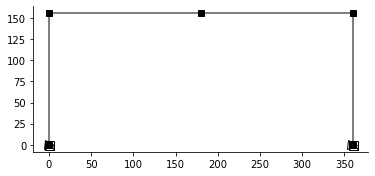
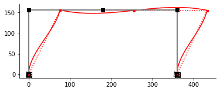

---
jupyter:
  kernelspec:
    display_name: Python 3
    language: python
    name: python3
  language_info:
    codemirror_mode:
      name: ipython
      version: 3
    file_extension: .py
    mimetype: text/x-python
    name: python
    nbconvert_exporter: python
    pygments_lexer: ipython3
    version: 3.8.8
  nbformat: 4
  nbformat_minor: 4
---

[{style="margin:auto; display: block; max-width: 75%"}](https://github.com/claudioperez/elle-0002/compare/v0.0.0...master)

``` {.python}
import anon
anon.conf.config.update('jax_disable_jit', True)
anon.conf.config.update("jax_enable_x64", True)
import anon.atom as anp
import elle.sections
import elle.beam2d
import anabel as em
geom_template = elle.beam2d.transform_no2(elle.beam2d.geom_no2)
beam_template = elle.beam2d.resp_no1
```

An `Assembler` is an object with an `.assemble()` and optionally a
`.compose()` method

``` {.python}
# Create a model Assembler
model = em.SkeletalModel(ndm=2,ndf=3)

# Define problem parameters
ColumnE  = model.param("ColumnE")
GirderE  = model.param("GirderE")
P1 = model.param("P1")

# Define model components
girder_section = em.aisc.load("w33x130")
column_section = em.aisc.load("w14x159")
basic_girder  = beam_template(**girder_section, E=GirderE)
basic_column  = beam_template(**column_section, E=ColumnE)

girder = geom_template(basic_girder)
column = geom_template(basic_column)
```

    WARNING:absl:No GPU/TPU found, falling back to CPU. (Set TF_CPP_MIN_LOG_LEVEL=0 and rerun for more info.)

``` {.python}
# Set up nodes
ft = 12
B, H = 30.*ft, 13.*ft
model.node("1",  0.,  0.)
model.node("2",  0.,  H )
model.node("3", B/2,  H )
model.node("4",  B ,  H )
model.node("5",  B ,  0.)

model.beam("a", "1", "2", **column_section, elem=column)
model.beam("b", "2", "3", **girder_section, elem=girder)
model.beam("c", "3", "4", **girder_section, elem=girder)
model.beam("d", "4", "5", **column_section, elem=column)

model.boun("1", [1,1,1])
model.boun("5", [1,1,1])

model.load("2", P1, dof="x")
model.load("2", -2e3, dof="y")
model.load("4", -2e3, dof="y")

em.plot_skeletal(model);
```

{style="margin:auto; display: block; max-width: 75%"}

``` {.python}
f = model.compose()
```

``` {.python}
f(3600.,3600.,2e3)
```

    /home/claudio/elle/numeric/elle/numeric/inverse.py:111: UserWarning: Function inversion failed to converge.
      warnings.warn("Function inversion failed to converge.")

    DeviceArray([[   0.28355172],
                 [ 171.74283748],
                 [   0.84689206],
                 [-202.66515683],
                 [-149.92389898],
                 [   5.04060219],
                 [ -14.82161937],
                 [-148.43045677],
                 [   5.1556104 ]], dtype=float64)

``` {.python}
fig, ax = em.plot_displ(model, f(29e6,29e6,20e3),scale=1e3)
```

    /home/claudio/elle/numeric/elle/numeric/inverse.py:111: UserWarning: Function inversion failed to converge.
      warnings.warn("Function inversion failed to converge.")

{style="margin:auto; display: block; max-width: 75%"}

``` {.python}
df = anon.diff.jacfwd(f, None, (0,1),squeeze=False)
```

``` {.python}
df(29e6,29e6,20e3)
```

    dx: Traced<ConcreteArray([[20000.]
     [-2000.]
     [    0.]
     [    0.]
     [    0.]
     [    0.]
     [    0.]
     [-2000.]
     [    0.]])>with<JVPTrace(level=2/0)>
      with primal = DeviceArray([[20000.],
                                 [-2000.],
                                 [    0.],
                                 [    0.],
                                 [    0.],
                                 [    0.],
                                 [    0.],
                                 [-2000.],
                                 [    0.]], dtype=float64)
           tangent = Traced<ShapedArray(float64[9,1])>with<BatchTrace(level=1/0)>
                       with val = DeviceArray([[[-0.],
                                                [-0.]],
                                  
                                               [[-0.],
                                                [-0.]],
                                  
                                               [[-0.],
                                                [-0.]],
                                  
                                               [[-0.],
                                                [-0.]],
                                  
                                               [[-0.],
                                                [-0.]],
                                  
                                               [[-0.],
                                                [-0.]],
                                  
                                               [[-0.],
                                                [-0.]],
                                  
                                               [[-0.],
                                                [-0.]],
                                  
                                               [[-0.],
                                                [-0.]]], dtype=float64)
                            batch_dim = 1

    /home/claudio/elle/numeric/elle/numeric/inverse.py:112: UserWarning: Function inversion failed to converge.
      warnings.warn("Function inversion failed to converge.")

    (DeviceArray([[-2.04476205e-09],
                  [-1.10382234e-11],
                  [ 7.00882848e-13],
                  [-2.04415680e-09],
                  [-5.35148746e-12],
                  [-2.71208496e-13],
                  [-2.04355123e-09],
                  [ 2.30895445e-11],
                  [ 9.53551267e-13]], dtype=float64),
     DeviceArray([[-5.79214813e-10],
                  [ 9.60734398e-13],
                  [ 7.15495715e-12],
                  [-5.24811184e-10],
                  [ 3.78153916e-11],
                  [-3.37652007e-12],
                  [-4.70407107e-10],
                  [-1.95779547e-12],
                  [ 6.30254346e-12]], dtype=float64))

``` {.python}
```
