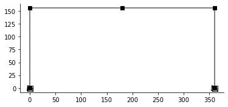

---
jupyter:
  kernelspec:
    display_name: Python 3
    language: python
    name: python3
  language_info:
    codemirror_mode:
      name: ipython
      version: 3
    file_extension: .py
    mimetype: text/x-python
    name: python
    nbconvert_exporter: python
    pygments_lexer: ipython3
    version: 3.8.8
  nbformat: 4
  nbformat_minor: 4
---

[{style="margin:auto; display: block; max-width: 75%"}](https://github.com/claudioperez/elle-0002/compare/v0.0.0...master)

``` {.python}
import anon.conf
anon.conf.config.update('jax_disable_jit', True)
import anon
import jax
import anon.atom as anp
import elle.sections
import elle.beam2d
import elle.springs
import emme as em
mat = elle.springs.isokin.no1(60.0,29e3)
# mat = elle.springs.gmp.no5(60.0,29e3)
sec = elle.sections.core_v2.Rectangle
geom_template = elle.beam2d.transform_no2(elle.beam2d.geom_no1)
beam_template = elle.beam2d.resp_no6
```

An `Assembler` is an object with an `.assemble()` and optionally a
`.compose()` method

``` {.python}
# Create a model Assembler
model = em.SkeletalModel(ndm=2,ndf=3)

# Define problem parameters
P1 = model.param("P1")

# Define model components
girder_section = sec(d=60.0, b=18.0,mat=mat).assemble()
column_section = sec(d=60.0, b=18.0,mat=mat).assemble()
basic_girder  = beam_template(*[girder_section]*8, quad={"n": 8, "rule": "mid"})
basic_column  = beam_template(*[column_section]*8, quad={"n": 8, "rule": "mid"})

girder = geom_template(basic_girder)
column = geom_template(basic_column)
```

``` {.python}
# Set up nodes
ft = 12
B, H = 30.*ft, 13.*ft
model.node("1",  0.,  0.)
model.node("2",  0.,  H )
model.node("3", B/2,  H )
model.node("4",  B ,  H )
model.node("5",  B ,  0.)

model.beam("a", "1", "2", elem=column)
model.beam("b", "2", "3", elem=girder)
model.beam("c", "3", "4", elem=girder)
model.beam("d", "4", "5", elem=column)

model.boun("1", [1,1,1])
model.boun("5", [1,1,1])

model.load("2", P1, dof="x")
model.load("2", -1.0, dof="y")
model.load("2", -1.0, dof="y")

em.plot_structure(model);
```

{style="margin:auto; display: block; max-width: 75%"}

``` {.python}
f = model.compose()
```

``` {.python}
f(1.0)
```

    [[ 1.63539291e-02]
     [-2.02570246e-03]
     [-9.55256367e-05]
     [ 1.50486513e-02]
     [-2.12649699e-03]
     [ 4.89535361e-05]
     [ 1.37433735e-02]
     [-3.81704943e-04]
     [-7.50191192e-05]]

    DeviceArray([[ 1.63539291e-02],
                 [-2.02570246e-03],
                 [-9.55256367e-05],
                 [ 1.50486513e-02],
                 [-2.12649699e-03],
                 [ 4.89535361e-05],
                 [ 1.37433735e-02],
                 [-3.81704943e-04],
                 [-7.50191192e-05]], dtype=float64)

``` {.python}
for i in range(3):
    fig, ax = em.plot_displ(model, f(30.*i),scale=1e1)
```

    [[-3.73841687e-04]
     [-2.39954415e-03]
     [ 4.79284214e-06]
     [-3.73841687e-04]
     [-1.20370370e-03]
     [ 7.55794337e-06]
     [-3.73841687e-04]
     [-7.86325663e-06]
     [ 4.79284214e-06]]
    [[ 0.50145928]
     [ 0.00881571]
     [-0.00300476]
     [ 0.46230095]
     [-0.0288875 ]
     [ 0.00124943]
     [ 0.42314261]
     [-0.01122311]
     [-0.00238957]]
    [[ 1.00329241]
     [ 0.02003096]
     [-0.00601432]
     [ 0.92497574]
     [-0.0565713 ]
     [ 0.00249129]
     [ 0.84665907]
     [-0.02243836]
     [-0.00478392]]

{style="margin:auto; display: block; max-width: 75%"}

{style="margin:auto; display: block; max-width: 75%"}

{style="margin:auto; display: block; max-width: 75%"}

``` {.python}
df = anon.diff.jacfwd(f, None, (0,1), squeeze=False)
```

``` {.python}
df(20.0)
```

    ---------------------------------------------------------------------------
    IndexError                                Traceback (most recent call last)
    <ipython-input-21-61fb48dc13d3> in <module>
    ----> 1 df(20.0)

    ~/pkgs/anon/src/anon/diff.py in jacobian(*args, **kwds)
         54         def jacobian(*args,**kwds):
         55             f = lu.wrap_init(f_transformed, kwds)
    ---> 56             f_partial, dyn_args = argnums_partial(f, argnums, args)
         57             jax.api.tree_map(partial(jax.api._check_input_dtype_jacfwd, holomorphic), dyn_args)
         58             pushfwd = partial(jax.api._jvp, f_partial, dyn_args)

    ~/extn/jax/jax/api_util.py in argnums_partial(f, dyn_argnums, args)
        103   fixed_args = tuple(unit if i in dyn_argnums else wrap_hashably(arg)
        104                      for i, arg in enumerate(args))
    --> 105   dyn_args = tuple(args[i] for i in dyn_argnums)
        106   return _argnums_partial(f, dyn_argnums, fixed_args), dyn_args
        107 

    ~/extn/jax/jax/api_util.py in <genexpr>(.0)
        103   fixed_args = tuple(unit if i in dyn_argnums else wrap_hashably(arg)
        104                      for i, arg in enumerate(args))
    --> 105   dyn_args = tuple(args[i] for i in dyn_argnums)
        106   return _argnums_partial(f, dyn_argnums, fixed_args), dyn_args
        107 

    IndexError: tuple index out of range

``` {.python}
m
```
