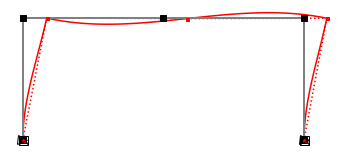

---
jupyter:
  kernelspec:
    display_name: Python 3
    language: python
    name: python3
  language_info:
    codemirror_mode:
      name: ipython
      version: 3
    file_extension: .py
    mimetype: text/x-python
    name: python
    nbconvert_exporter: python
    pygments_lexer: ipython3
    version: 3.8.8
  nbformat: 4
  nbformat_minor: 4
---

# `0023` {#0023}

[{style="margin:auto; display: block; max-width: 75%"}](https://github.com/claudioperez/elle-0002/compare/v0.0.0...master)

``` {.python}
import anon
# anon.conf.config.update('jax_disable_jit', True)
anon.conf.config.update("jax_enable_x64", True)
import anabel.backend as anp
import anabel as em
from jax.test_util import check_grads
import elle.sections
import elle.beam2d
geom_template = elle.beam2d.transform_no2(elle.beam2d.geom_no1)
beam_template = elle.beam2d.resp_no1
```

An `Assembler` is an object with an `.assemble()` and optionally a
`.compose()` method

``` {.python}
# Create a model Assembler
model = em.SkeletalModel(ndm=2,ndf=3)

# Define problem parameters
ColumnArea  = model.param("ColumnArea")
ColumnMOI  = model.param("ColumnMOI")
GirderArea  = model.param("GirderArea")
GirderMOI  = model.param("GirderMOI")
P1 = model.param("P1")

# Define model components
column_section = {"A": ColumnArea, "E": 3600.0, "I": ColumnMOI}
girder_section = {"A": GirderArea, "E": 3600.0, "I": GirderMOI}
basic_girder  = beam_template(**girder_section)
basic_column  = beam_template(**column_section)

girder = geom_template(basic_girder)
column = geom_template(basic_column)
```

    WARNING:absl:No GPU/TPU found, falling back to CPU. (Set TF_CPP_MIN_LOG_LEVEL=0 and rerun for more info.)

``` {.python}
# Set up nodes
ft = 12
B, H = 30.*ft, 13.*ft
model.node("1",  0.,  0.)
model.node("2",  0.,  H )
model.node("3", B/2,  H )
model.node("4",  B ,  H )
model.node("5",  B ,  0.)

model.beam("a", "1", "2", **column_section, elem=column)
model.beam("b", "2", "3", **girder_section, elem=girder)
model.beam("c", "3", "4", **girder_section, elem=girder)
model.beam("d", "4", "5", **column_section, elem=column)

model.boun("1", [1,1,1])
model.boun("5", [1,1,1])

model.load("2",   P1, dof="x")
model.load("2", -2.0, dof="y")
model.load("4", -2.0, dof="y")

em.plot_skeletal(model);
```

{style="margin:auto; display: block; max-width: 75%"}

``` {.python}
f = model.compose()
```

``` {.python}
U = f(30**2.,684.0,1e3)
U
```

    DeviceArray([[ 1.52848857],
                 [ 0.00583992],
                 [-0.01110097],
                 [ 1.49259297],
                 [-0.02807216],
                 [ 0.0053456 ],
                 [ 1.45669737],
                 [-0.00603251],
                 [-0.01047929]], dtype=float64)

``` {.python}
for i,u in enumerate(anp.array([[ 1.52848857],
                                [ 0.00583992],
                                [-0.01110097],
                                [ 1.49259297],
                                [-0.02807216],
                                [ 0.0053456 ],
                                [ 1.45669737],
                                [-0.00603251],
                                [-0.01047929]])):
    assert abs(U[i] - u) < 1e-7
```

``` {.python}
fig, ax = em.plot_displ(model, f(30**2.,684.0,1e3),scale=2e1)
ax.axis("off")
fig.savefig("/home/claudio/prnt/ms-thesis/doc/img/frame.svg")
```

{style="margin:auto; display: block; max-width: 75%"}

``` {.python}
df = anon.diff.jacfwd(f, None, (0,1), squeeze=False)
```

``` {.python}
df(30**2.,684.0,1e3)
```

    (DeviceArray([[-1.62639751e-06],
                  [-6.48010720e-06],
                  [ 2.08512502e-08],
                  [-1.62639751e-06],
                  [ 1.06995885e-07],
                  [ 4.44669006e-08],
                  [-1.62639751e-06],
                  [ 6.69409896e-06],
                  [ 2.08512502e-08]], dtype=float64),
     DeviceArray([[-5.15397694e-05],
                  [-1.28712372e-20],
                  [ 4.46315830e-07],
                  [-3.53933002e-18],
                  [ 4.01684247e-05],
                  [-1.34782635e-20],
                  [ 5.15397694e-05],
                  [ 1.48398390e-20],
                  [-4.46315830e-07]], dtype=float64))

``` {.python}
check_grads(f, (30**2.,684.0,1e3), order=1)  
```

    WARNING:absl:No GPU/TPU found, falling back to CPU. (Set TF_CPP_MIN_LOG_LEVEL=0 and rerun for more info.)
