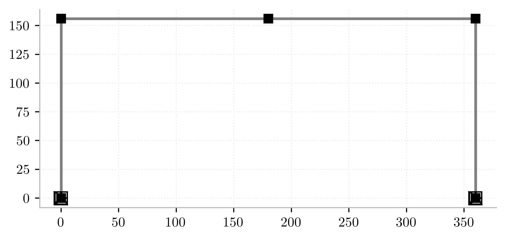
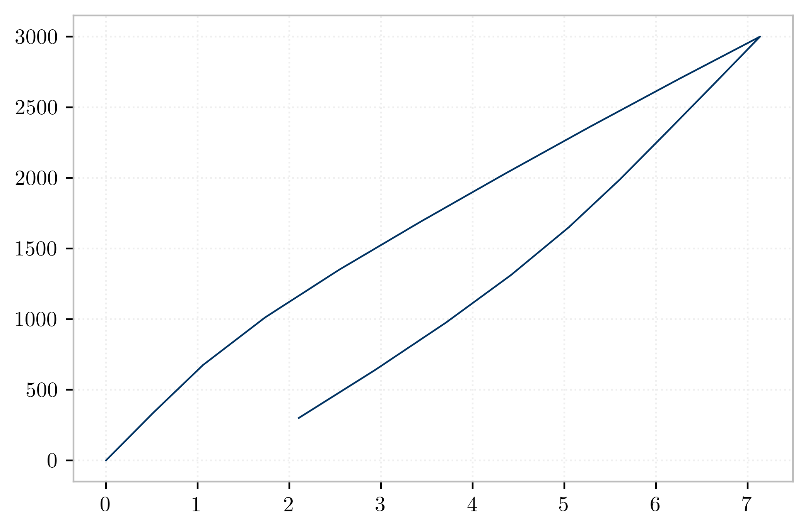

---
jupyter:
  kernelspec:
    display_name: Python 3
    language: python
    name: python3
  language_info:
    codemirror_mode:
      name: ipython
      version: 3
    file_extension: .py
    mimetype: text/x-python
    name: python
    nbconvert_exporter: python
    pygments_lexer: ipython3
    version: 3.8.8
  nbformat: 4
  nbformat_minor: 4
---

[{style="margin:auto; display: block; max-width: 75%"}](https://github.com/claudioperez/elle-0002/compare/v0.0.0...master)

``` {.python}
import elle.numeric
import matplotlib.pyplot as plt
plt.style.use("typewriter")
```

``` {.python}
import anon.conf
anon.conf.config.update('jax_disable_jit', True)
anon.conf.config.update('jax_enable_x64', True)
import anabel
import anon
import jax
import anon.atom as anp
import elle.sections
import elle.beam2d
import elle.springs
import anabel as em
mat = elle.springs.isokin.no1(3600.0,4.0,H0=3.0)
# mat = elle.springs.gmp.no5(60.0,29e3)
GirderSec = anabel.sections.Tee
ColumnSec = anabel.sections.Rectangle
geom_template = elle.beam2d.transform_no2(elle.beam2d.geom_no2)
beam_template = elle.beam2d.resp_no6
```

An `Assembler` is an object with an `.assemble()` and optionally a
`.compose()` method

``` {.python}
# Create a model Assembler
model = em.SkeletalModel(ndm=2,ndf=3)

# Define problem parameters
P1 = model.param("P1")

# Define model components
girder_section = GirderSec(d=24.0, bf=60.0, tf=6.0, tw=18.0, mat=mat).assemble()
column_section = ColumnSec(d=30.0, b=30.0,mat=mat).assemble()
basic_girder  = beam_template(*[girder_section]*4, quad={"n": 4, "rule": "lobatto"})
# basic_column  = beam_template(*[column_section]*8, quad={"n": 4, "rule": "mid"})
basic_column = elle.beam2d.resp_no1(A=30.0**2,E=3600.0,I=30**4/12)

girder = geom_template(basic_girder)
column = geom_template(basic_column)
```

    WARNING:absl:No GPU/TPU found, falling back to CPU. (Set TF_CPP_MIN_LOG_LEVEL=0 and rerun for more info.)

``` {.python}
# Set up nodes
ft = 12.
B, H = 30.*ft, 13.*ft
model.node("1",  0.,  0.)
model.node("2",  0.,  H )
model.node("3", B/2,  H )
model.node("4",  B ,  H )
model.node("5",  B ,  0.)

model.beam("a", "1", "2", elem=column)
model.beam("b", "2", "3", elem=girder)
model.beam("c", "3", "4", elem=girder)
model.beam("d", "4", "5", elem=column)

model.boun("1", [1,1,1])
model.boun("5", [1,1,1])

model.load("2", P1, dof="x")
model.load("2", -2.0, dof="y")
model.load("2", -2.0, dof="y")

em.plot_skeletal(model);
```

{style="margin:auto; display: block; max-width: 75%"}

``` {.python}
model.dofs
```

    [[9, 10, 11], [0, 1, 2], [3, 4, 5], [6, 7, 8], [12, 13, 14]]

``` {.python}
f = model.compose_displ()
```

``` {.python}
model.cycle(0, 0, 3000, 10,2,0)
P = model.build_load_path(0)
```

``` {.python}
F = elle.numeric.accumulate(f)
```

``` {.python}
X, Y, S = F(P)
```

    0/18
    1/18
    2/18

    /home/claudio/elle/numeric/elle/numeric/inverse.py:149: UserWarning: Function inversion failed to converge.
      warnings.warn("Function inversion failed to converge.")

    3/18

    /home/claudio/elle/numeric/elle/numeric/inverse.py:149: UserWarning: Function inversion failed to converge.
      warnings.warn("Function inversion failed to converge.")

    4/18

    /home/claudio/elle/numeric/elle/numeric/inverse.py:149: UserWarning: Function inversion failed to converge.
      warnings.warn("Function inversion failed to converge.")

    5/18

    /home/claudio/elle/numeric/elle/numeric/inverse.py:149: UserWarning: Function inversion failed to converge.
      warnings.warn("Function inversion failed to converge.")

    6/18

    /home/claudio/elle/numeric/elle/numeric/inverse.py:149: UserWarning: Function inversion failed to converge.
      warnings.warn("Function inversion failed to converge.")

    7/18

    /home/claudio/elle/numeric/elle/numeric/inverse.py:149: UserWarning: Function inversion failed to converge.
      warnings.warn("Function inversion failed to converge.")

    8/18

    /home/claudio/elle/numeric/elle/numeric/inverse.py:149: UserWarning: Function inversion failed to converge.
      warnings.warn("Function inversion failed to converge.")

    9/18

    /home/claudio/elle/numeric/elle/numeric/inverse.py:149: UserWarning: Function inversion failed to converge.
      warnings.warn("Function inversion failed to converge.")

    10/18

    /home/claudio/elle/numeric/elle/numeric/inverse.py:149: UserWarning: Function inversion failed to converge.
      warnings.warn("Function inversion failed to converge.")

    11/18

    /home/claudio/elle/numeric/elle/numeric/inverse.py:149: UserWarning: Function inversion failed to converge.
      warnings.warn("Function inversion failed to converge.")

    12/18

    /home/claudio/elle/numeric/elle/numeric/inverse.py:149: UserWarning: Function inversion failed to converge.
      warnings.warn("Function inversion failed to converge.")

    13/18

    /home/claudio/elle/numeric/elle/numeric/inverse.py:149: UserWarning: Function inversion failed to converge.
      warnings.warn("Function inversion failed to converge.")

    14/18

    /home/claudio/elle/numeric/elle/numeric/inverse.py:149: UserWarning: Function inversion failed to converge.
      warnings.warn("Function inversion failed to converge.")

    15/18

    /home/claudio/elle/numeric/elle/numeric/inverse.py:149: UserWarning: Function inversion failed to converge.
      warnings.warn("Function inversion failed to converge.")

    16/18

    /home/claudio/elle/numeric/elle/numeric/inverse.py:149: UserWarning: Function inversion failed to converge.
      warnings.warn("Function inversion failed to converge.")

    17/18

    /home/claudio/elle/numeric/elle/numeric/inverse.py:149: UserWarning: Function inversion failed to converge.
      warnings.warn("Function inversion failed to converge.")

``` {.python}
```

``` {.python}
plt.plot(Y[:,0,:],P[:,0,:])
```

    [<matplotlib.lines.Line2D at 0x7f988409aac0>]

{style="margin:auto; display: block; max-width: 75%"}

``` {.python}
model.dofs
```

    [[9, 10, 11], [0, 1, 2], [3, 4, 5], [6, 7, 8], [12, 13, 14]]

``` {.python}
```
