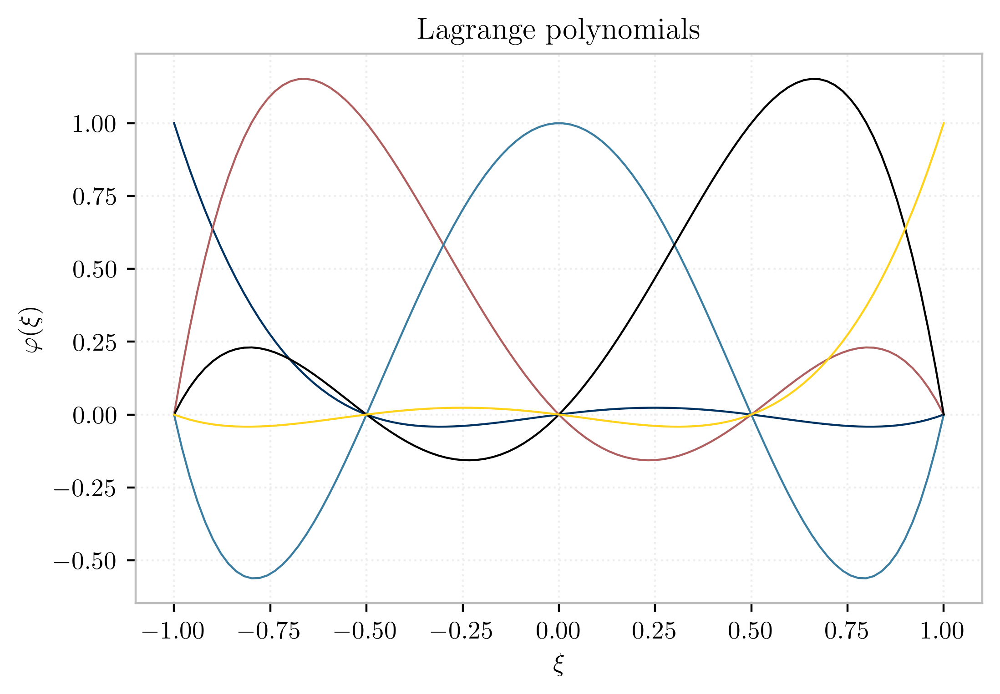
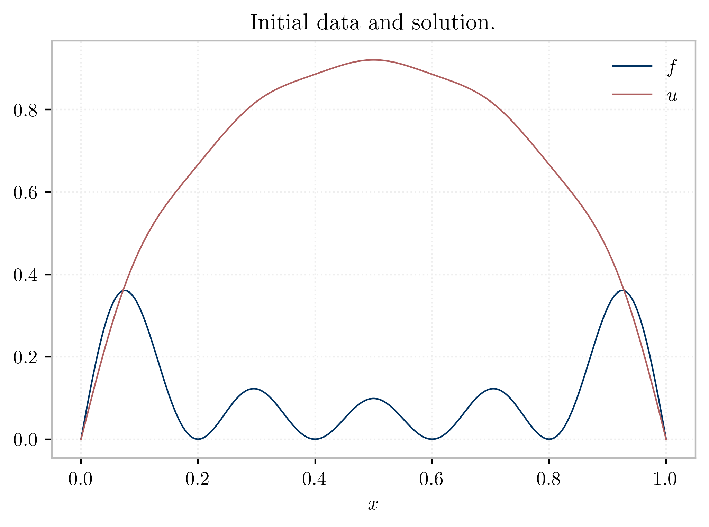
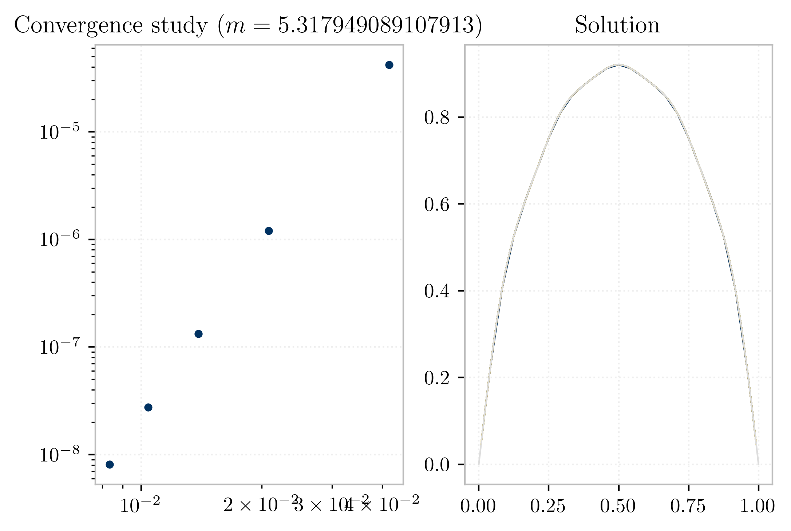
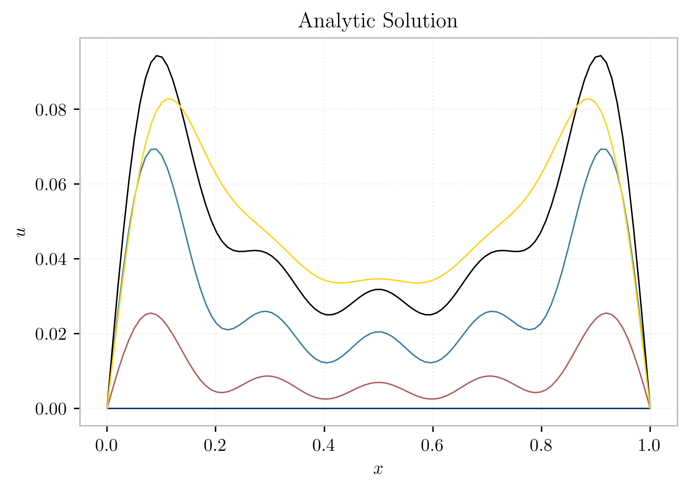
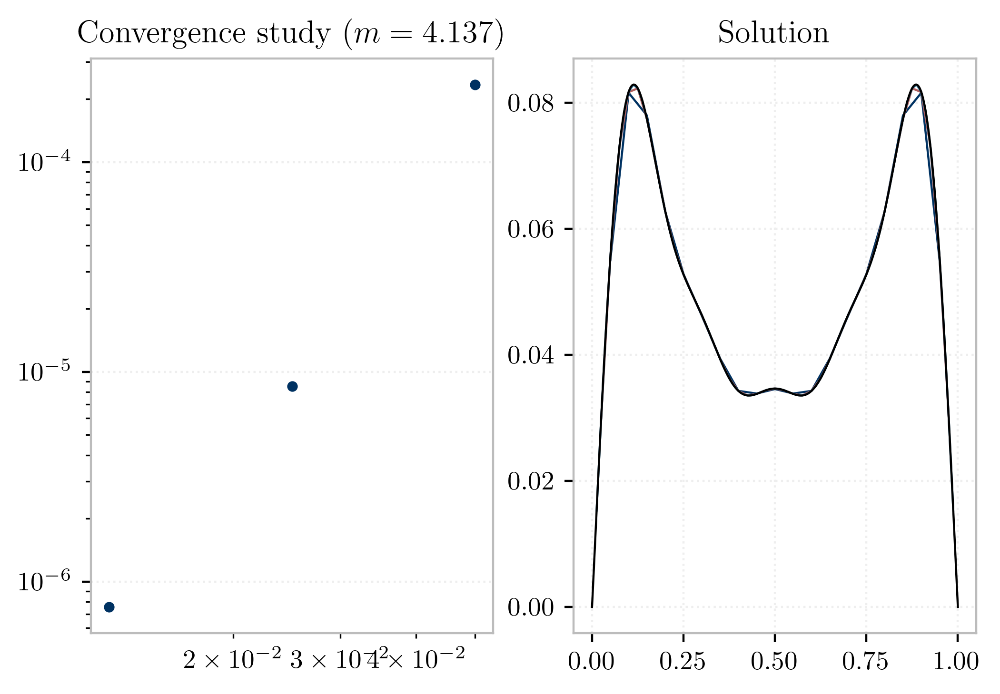
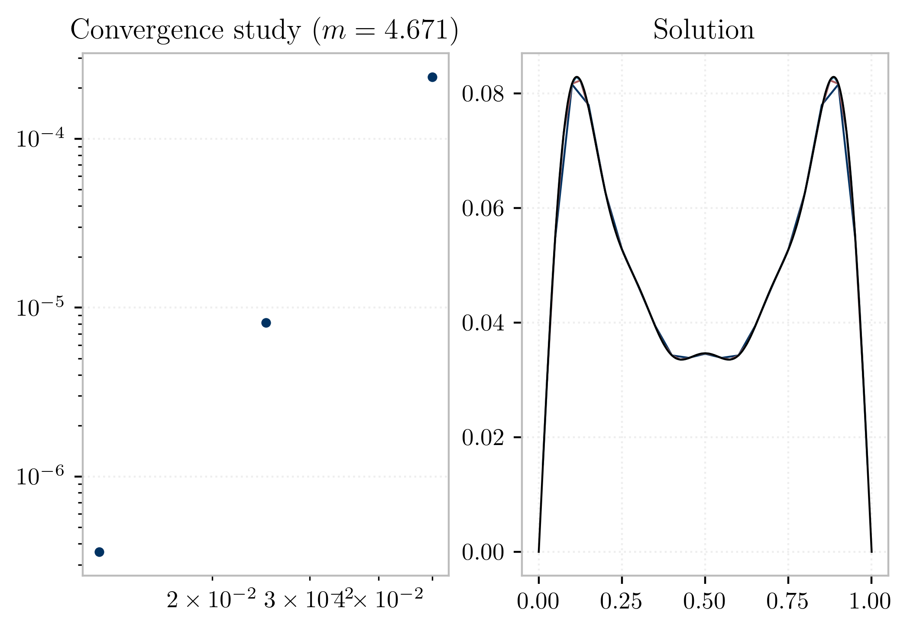

# Transient Heat 

$-\alpha u_{xx} + Au = f$

>Consider the modified Poisson equation
>$$
  -\alpha u_{xx} + Au = f, \quad (0\le x\le 1), \qquad u(0)=0,\; u(1)=0,
>$$
>where $\alpha>0$ and $A\ge0$. 

<!--
4th order finite elments on a uniformly spaced grid,

$$
x_j = j/M, \qquad\quad 0\le j\le M
$$

where $M$ is divisible by 4 and the $r$th element includes nodes $x_{4r+i}$ for
$0\le r<M/4$ and $0\le i\le 4$. 
-->

## Part A

Multiplying by a test function $v$ and integrating over the domain (applying integration by parts) yields:

$$
\int_\Omega -\alpha u_{xx} v + \gamma u v = \int_\Omega f v
$$

$$
\int \alpha u_x v_x dx - \left. \alpha u_x v \right| + \gamma \int u v dx = \int f v dx
$$

For test functions which vanish on the boundary one obtains:

$$
\int_\Omega \alpha u_x v_x + \gamma u v = \int_\Omega f v
$$

$$
a(\alpha u,v) + \langle Au,v \rangle = \langle f,v\rangle
$$

### Fourth-order element

A fourth order isoparametric 1D element is developed by applying Lagrange interpolation over 5 equally spaced sampling points. These are plotted in @fig:lagrange-shape.

{#fig:lagrange-shape}


### Convergence

>(a) Do a convergence study for $\alpha=1/100$, $A=0$ and $f(x)=\frac{\pi^2}{100}\sum_{k=0}^4 \sin\big((2k+1)\pi x \big)$.

The exact integral for this problem is as follows:

$$
\frac{1}{\alpha 100} \sum{\frac{1}{(2k+1)^2}\sin{\left((2k+1)\pi x\right)} }
$$





\pagebreak

## Part B: Transient Analysis

>(b) Solve $u_t=\frac1{100}u_{xx}+f(x)\sin(\pi t)$ from $t=0$ to
$t=1$ with initial condition $u(x,0)=0$ and the same $f$ as in part (a).  Use the 4th order implicit SDIRK timestepper with Butcher array given below.

The exact solution of the transient problem was derrived using the `sympy` CAS library. A plot is shown below for various times.




### SDIRK Implementation

In HW2 a Runge-Kutta algorithm was implemented for problems with the following form:

$$
\mathbf{u}_t + B\mathbf{u} = \mathbf{d}(t)
$$

Where $B$ is a linear operator . At stage $i$ of a diagonal Runge-Kutta method one has

$$
\ell_{i}=F\left(t_{n}+c_{i} k, \vec{u}_{n}+k \sum_{j=1}^{i-1} a_{i j} \ell_{j}+k a_{i j} \ell_{i}\right)
$$

where $k=\Delta t$. For problems of the aforementioned form, this simplifies to

$$
\left(I - k a_{i i} B\right) \ell_{i} = B \left(\vec{u}_{n}+k \sum_{j=1}^{i-1} a_{i j} \ell_{j}\right) + d(t_n+c_i k) 
$$

The following data is required to set up a particular scheme for $\mathbf{u}\in \mathbb{R}^n$ with $s\in\mathbf{Z^+}$ stages:

$\mathcal{T}$
: A Butcher tableau with zero entries above the diagonal.

$B, \mathbb{R}^n \rightarrow \mathbb{R}^n$: Discrete space operator

$\mathbf{d}, \mathbb{R} \rightarrow \mathbb{R}^n$
: Source term.

The problem at hand is manipulated to fit the following form:

$$\vec{u}_{t}=-\frac{1}{100} {M}^{-1} A \vec{u}+\vec{f} \sin \pi t$$

so that 

$$
\begin{gathered}
B=\frac{-1}{100}M^{-1}A \\
\mathbf{d}=M^{-1}b\sin{\pi t}
\end{gathered}
$$


where $A$, $M$, and $b$ are the stiffness, mass and load vectors as readily produced by the implementation for Part B.

$$
\left(M+\frac{k a_{i i}}{100} A\right) l_{i} = -\frac{1}{100} A\left(\vec{u}_{n}+k \sum_{j=1}^{i-1} a_{i j} \ell_{j}\right) + M \vec{f} \sin \pi\left(t_{n}+c_{i} k\right)
$$


The tableau $\mathcal{T}$ is given as 

$$
\begin{array}{c|ccccc}
  1/4 & 1/4 \\
  3/4 & 1/2 & 1/4 \\
  11/20 & 17/50 & -1/25 & 1/4 \\
  1/2 & 371/1360 & -137/2720 & 15/544 & 1/4 \\
  1 & 25/24 & -49/48 & 125/16 & -85/12 & 1/4 \\
  \hline
  & 25/24 & -49/48 & 125/16 & -85/12 & 1/4
\end{array}
$$


---------------

$u(x,t) = \sum_j u_j(t)\phi_j(x)$

$$u_{t}=\frac{1}{100} u_{x x}+f(x) \sin \pi t$$

let $u_t = \sum_ju_{j,t}\phi_j$, and $v=\phi_i$

$$
\langle u_{t}, v\rangle = -\frac{1}{100} a(u, v)+\langle f, v\rangle \sin \pi t
$$


$$
M \vec{u}_{t}=-\frac{1}{100} A \vec{u} + M \vec{f} \sin \pi t
$$


$$
\vec{u}_{t}=-\frac{1}{100} {M}^{-1} A \vec{u}+\vec{f} \sin \pi t
$$

<!-- where $M^{-1}A$ is a FE approximation to $-\Delta()$. -->


### Convergence

Convergence studies are presented below for time discretizations using both the SDIRK scheme provided and the Crank-Nicolson scheme.





\pagebreak

# Appendix

## Source Code

### Fourth-order Lagrange element

```{include=elle_0001.py .python}
```

\pagebreak

### Analytic Transient Solution

```{include=p3b.py .python}
```

