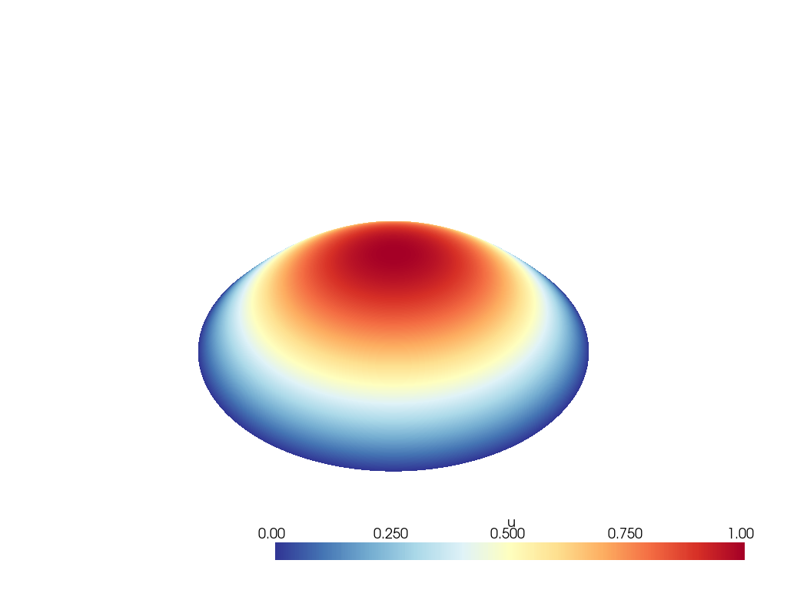
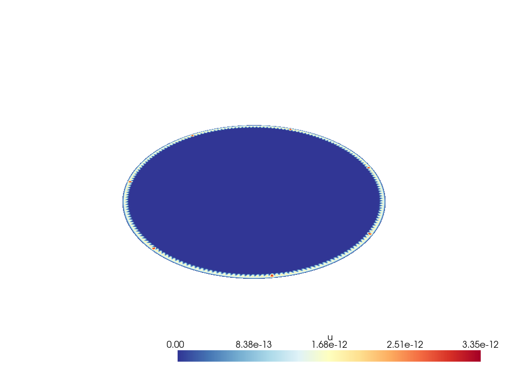
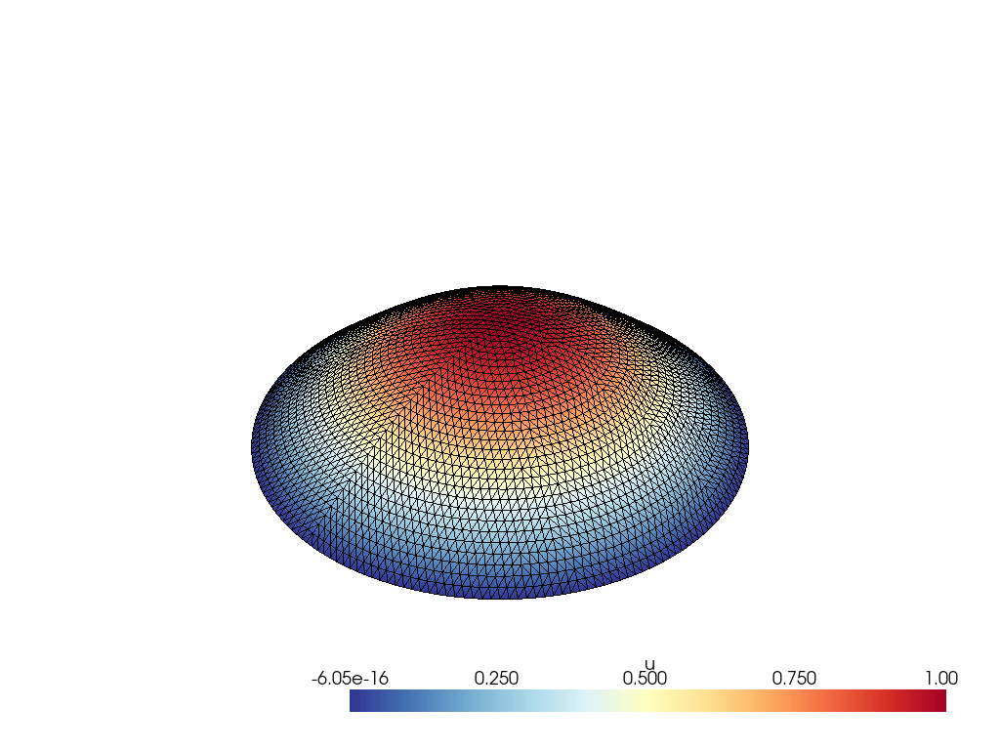
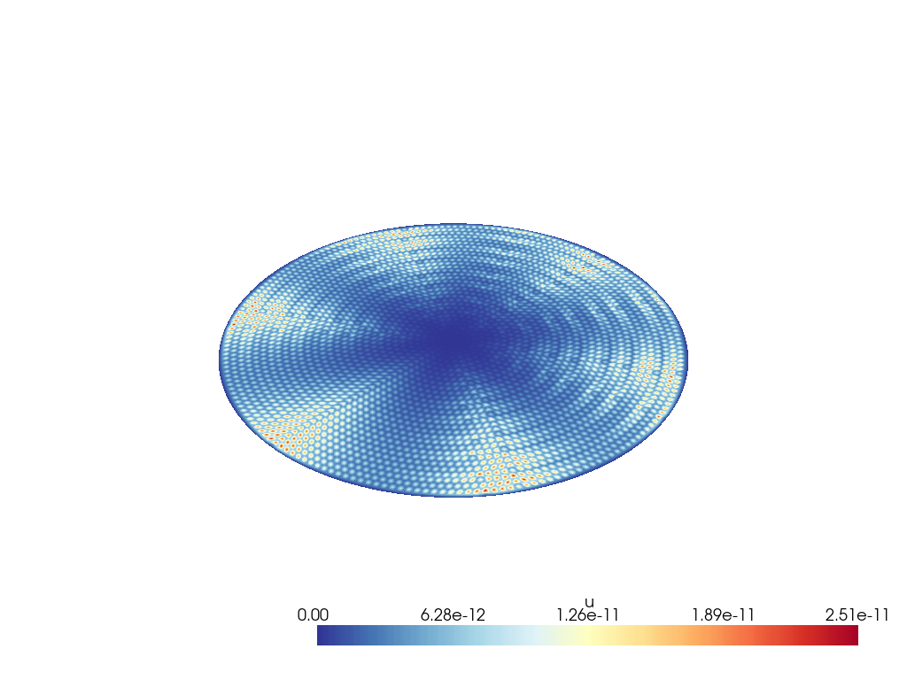

---
title: Poisson Equation in 2D
...

# Part 1: Base case

>Consider the Dirichlet problem
>
>$$
>  \begin{aligned}
>    -\Delta u &= 4, & \quad &\text{in $\Omega$} \\
>            u &= 0, & &\text{on $\partial\Omega$}
>  \end{aligned}
>$$
>
>on the unit disk $\Omega=\{(x,y)\;:\; x^2+y^2\le 1\}$
 
The exact solution to this problem is 

$$
\boxed{u = 1 - x^2 - y^2}
$$

A function implementing quadratic Lagrange interpolation over a reference triangle is implemented in the file [`interpolate.py`](src/interpolate.py) which is used by the function `poisson2` from `poisson.py` to create a finite element that locally evaluates the following variational Poisson problem


$$
\sum_{j=1}^{n} \mathbf{u}_{j} \int_{\Omega} \nabla \phi_{j} \cdot \nabla \phi_{i}=\int_{\Omega} \phi_{i} f+\int_{\partial \Omega_{N}} \phi_{i} g_{N}-\sum_{j=n+1}^{n+n_{\partial}} \mathbf{u}_{j} \int_{\Omega} \nabla \phi_{j} \cdot \nabla \phi_{i}
$$

A model is constructed by loading a pre-defined mesh from the file `mesh.m228` as follows:

```python
model =  anabel.MeshGroup.read(f"../dat/circle_iso/mesh.m228", cell="triangle6")
elem = poisson(*[lagrange_t6()]*3, f=f)
U = model.compose(elem=elem, solver="sparse", verbose=True)
```

This builds a function `U` which accepts quadrature locations and weights as input. Given a particular quadrature rule, a solution may be computed and plotted as follows:

```python
quad = anon.quad.simplex.Simplex.load(f"../dat/quadrature/gauss{g:02}.m")
model.plot(U(quad.points, quad.weights))
```

<!--
Element stiffness matrix:

$$
\begin{aligned}
a_{i j}^{(k)}=& \int_{\Delta *}\left(b_{2} \frac{\partial \psi_{*, i}}{\partial \xi}+b_{3} \frac{\partial \psi_{*, i}}{\partial \eta}\right)\left(b_{2} \frac{\partial \psi_{*, j}}{\partial \xi}+b_{3} \frac{\partial \psi_{*, j}}{\partial \eta}\right) \frac{1}{\left|J_{k}\right|} \mathrm{d} \xi \mathrm{d} \eta \\
&+\int_{\triangle *}\left(c_{2} \frac{\partial \psi_{*, i}}{\partial \xi}+c_{3} \frac{\partial \psi_{*, i}}{\partial \eta}\right)\left(c_{2} \frac{\partial \psi_{*, j}}{\partial \xi}+c_{3} \frac{\partial \psi_{*, j}}{\partial \eta}\right) \frac{1}{\left|J_{k}\right|} \mathrm{d} \xi \mathrm{d} \eta
\end{aligned}
$$

$$
\begin{aligned}
a_{i j}^{(k)} &=\int_{\Delta_{k}} \frac{\partial \psi_{k, i}}{\partial x} \frac{\partial \psi_{k, j}}{\partial x}+\frac{\partial \psi_{k, i}}{\partial y} \frac{\partial \psi_{k, j}}{\partial y} \mathrm{~d} x \mathrm{~d} y \quad i, j=1, \ldots, n_{k} \\
&=\int_{\Delta *}\left\{\frac{\partial \psi_{*, i}}{\partial x} \frac{\partial \psi_{*, j}}{\partial x}+\frac{\partial \psi_{*, i}}{\partial y} \frac{\partial \psi_{*, j}}{\partial y}\right\}\left|J_{k}\right| \mathrm{d} \xi \mathrm{d} \eta
\end{aligned}
$$
-->

{width=50%}


{width=50%}


{width=50%}
{width=50%}

\pagebreak


```{.include}
convergence-tab.md
```


<!--
Find $u$ such that

$$
\begin{array}{c}
-\nabla^{2} u=f \quad \text { in } \Omega \\
u=g_{D} \text { on } \partial \Omega_{D} \quad \text { and } \quad \frac{\partial u}{\partial n}=g_{N} \text { on } \partial \Omega_{N},
\end{array}
$$
where $\partial \Omega_{D} \cup \partial \Omega_{N}=\partial \Omega$ and $\partial \Omega_{D}$ and $\partial \Omega_{N}$ are distinct.
-->

<!-- Weak form
Find $u \in \mathcal{H}_{E}^{1}$ such that

$$
\int_{\Omega} \nabla u \cdot \nabla v=\int_{\Omega} v f+\int_{\partial \Omega_{N}} v g_{N} \quad \text { for all } v \in \mathcal{H}_{E_{0}}^{1}
$$
-->


\pagebreak

# Nonlinear Source

>
>$$
>  \begin{aligned}
>    -\Delta u &= \frac{\pi^2}{4}\left(\cos\frac{\pi r}{2} +
>    \operatorname{sinc} \frac{\pi r}{2}\right), & \quad &\text{in $\Omega$} \\
>            u &= 0, & &\text{on $\partial\Omega$}
>  \end{aligned}
>$$
>
>where $\Omega$ is again the unit disk.  The exact solution is
>$u(x,y)=\cos \frac{\pi r}{2}$, where $r=\sqrt{x^2+y^2}$.

{width=50%}


\pagebreak

# Contributions from Errors 

>
>$$
  \iint_T \nabla(u_{FE} - u_{exact}) \cdot
  \nabla(u_{FE} - u_{exact})\,dx \, dy, \qquad
  (T\in\mathcal{T})
>$$
>

>The $H^1$ semi-norm error in the finite element solution is the square
>root of the sum of all the errors shown here. 

{width=50%}
{width=50%}

\pagebreak

# Appendix

\pagebreak

## Source Code of Interest

```{include=src/poisson.py .python}
```

