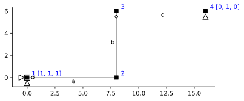
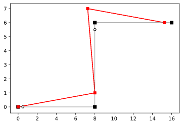

---
title: Kinematics - Kernel Analysis
description: This problem uses the kernel of the kinematic matrix to explore mechanisms in a frame structure.
...

# Kinematics - Kernel Analysis


```python
import ema as em
import matplotlib.pyplot as plt
import numpy as np
%config InlineBackend.figure_format = 'svg' # used to make plots look nicerbb
```


```python
mdl = em.Model(2,3)
n = mdl.dnodes
e = mdl.delems

mdl.node('1',  0.0, 0.0)
mdl.node('2',  8.0, 0.0)
mdl.node('3',  8.0, 6.0)
mdl.node('4', 16.0, 6.0)

mdl.beam('a', n['1'], n['2'])
mdl.beam('b', n['2'], n['3'])
mdl.beam('c', n['3'], n['4'])

mdl.hinge(e['a'], n['1'])
mdl.hinge(e['b'], n['3'])

mdl.fix(n['1'], ['x', 'y', 'rz'])
mdl.fix(n['4'], ['y'])

mdl.numDOF()
```


    [[9, 10, 11], [1, 2, 3], [4, 5, 6], [7, 12, 8]]


```python
em.analysis.characterize(mdl)
```

    m = 1
    s = 0
    


```python
fig, ax = plt.subplots(1,1)
em.plot_structure(mdl, ax)
```





```python
A = em.A_matrix(mdl)
A.f
```


<table border="1" class="dataframe">
  <thead>
    <tr style="text-align: right;">
      <th></th>
      <th>$1$</th>
      <th>$2$</th>
      <th>$3$</th>
      <th>$4$</th>
      <th>$5$</th>
      <th>$6$</th>
      <th>$7$</th>
      <th>$8$</th>
    </tr>
  </thead>
  <tbody>
    <tr>
      <th>$a_1$</th>
      <td>1.000000</td>
      <td>0.000</td>
      <td>0.0</td>
      <td>0.000000</td>
      <td>0.000</td>
      <td>0.0</td>
      <td>0.0</td>
      <td>0.0</td>
    </tr>
    <tr>
      <th>$a_2$</th>
      <td>0.000000</td>
      <td>-0.125</td>
      <td>0.0</td>
      <td>0.000000</td>
      <td>0.000</td>
      <td>0.0</td>
      <td>0.0</td>
      <td>0.0</td>
    </tr>
    <tr>
      <th>$a_3$</th>
      <td>0.000000</td>
      <td>-0.125</td>
      <td>1.0</td>
      <td>0.000000</td>
      <td>0.000</td>
      <td>0.0</td>
      <td>0.0</td>
      <td>0.0</td>
    </tr>
    <tr>
      <th>$b_1$</th>
      <td>-0.000000</td>
      <td>-1.000</td>
      <td>0.0</td>
      <td>0.000000</td>
      <td>1.000</td>
      <td>0.0</td>
      <td>0.0</td>
      <td>0.0</td>
    </tr>
    <tr>
      <th>$b_2$</th>
      <td>-0.166667</td>
      <td>0.000</td>
      <td>1.0</td>
      <td>0.166667</td>
      <td>-0.000</td>
      <td>0.0</td>
      <td>0.0</td>
      <td>0.0</td>
    </tr>
    <tr>
      <th>$b_3$</th>
      <td>-0.166667</td>
      <td>0.000</td>
      <td>0.0</td>
      <td>0.166667</td>
      <td>-0.000</td>
      <td>1.0</td>
      <td>0.0</td>
      <td>0.0</td>
    </tr>
    <tr>
      <th>$c_1$</th>
      <td>0.000000</td>
      <td>0.000</td>
      <td>0.0</td>
      <td>-1.000000</td>
      <td>-0.000</td>
      <td>0.0</td>
      <td>1.0</td>
      <td>0.0</td>
    </tr>
    <tr>
      <th>$c_2$</th>
      <td>0.000000</td>
      <td>0.000</td>
      <td>0.0</td>
      <td>-0.000000</td>
      <td>0.125</td>
      <td>1.0</td>
      <td>0.0</td>
      <td>0.0</td>
    </tr>
    <tr>
      <th>$c_3$</th>
      <td>0.000000</td>
      <td>0.000</td>
      <td>0.0</td>
      <td>-0.000000</td>
      <td>0.125</td>
      <td>0.0</td>
      <td>0.0</td>
      <td>1.0</td>
    </tr>
  </tbody>
</table>


```python
A_cm = A.c.ker / -0.561490
A_cm
```


<table border="1" class="dataframe">
  <thead>
    <tr style="text-align: right;">
      <th></th>
      <th>$1$</th>
    </tr>
  </thead>
  <tbody>
    <tr>
      <th>$1$</th>
      <td>-0.000</td>
    </tr>
    <tr>
      <th>$2$</th>
      <td>1.000</td>
    </tr>
    <tr>
      <th>$3$</th>
      <td>0.125</td>
    </tr>
    <tr>
      <th>$4$</th>
      <td>-0.750</td>
    </tr>
    <tr>
      <th>$5$</th>
      <td>1.000</td>
    </tr>
    <tr>
      <th>$6$</th>
      <td>-0.125</td>
    </tr>
    <tr>
      <th>$7$</th>
      <td>-0.750</td>
    </tr>
    <tr>
      <th>$8$</th>
      <td>-0.125</td>
    </tr>
  </tbody>
</table>


```python
em.plot_U(mdl, A_cm, ax, scale=1)
```

    1
    2
    3
    4
    5
    6
    7
    8
    




