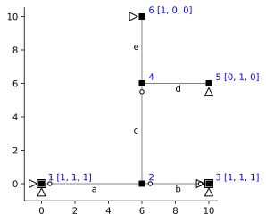
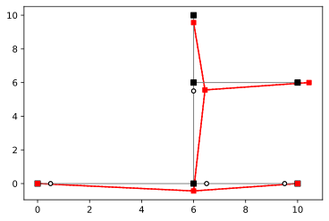

# Kinematics 3

```python
import ema as em
import numpy as np
import sympy as sp
import matplotlib.pyplot as plt
%config InlineBackend.figure_format = 'svg'
```

```python
#Remove
mdl = em.Model(2,3)
n = mdl.dnodes
e = mdl.delems

mdl.node('1', 0.0, 0.0)
mdl.node('2', 6.0, 0.0)
mdl.node('3', 10., 0.0)
mdl.node('4', 6.0, 6.0)
mdl.node('5', 10., 6.0)
mdl.node('6', 6.0, 10.)

mdl.beam('a', n['1'], n['2'])
mdl.beam('b', n['2'], n['3'])
mdl.beam('c', n['2'], n['4'])
mdl.beam('d', n['4'], n['5'])
mdl.beam('e', n['4'], n['6'])

mdl.hinge(e['a'], n['1'])
mdl.hinge(e['b'], n['2'])
mdl.hinge(e['b'], n['3'])
mdl.hinge(e['c'], n['4'])

mdl.fix(n['1'], ['x', 'y', 'rz'])
mdl.fix(n['3'], ['x','y','rz'])
mdl.fix(n['5'], ['y'])
mdl.fix(n['6'], ['x'])

mdl.numDOF()
em.analysis.characterize(mdl)
mdl.DOF
```

    m = 1
    s = 2
    

    [[11, 12, 13], [1, 2, 3], [14, 15, 16], [4, 5, 6], [7, 17, 8], [18, 9, 10]]


```python
#Remove
fig, ax = plt.subplots(1,1)
em.plot_structure(mdl, ax)
```





```python
# Matrices
B = em.B_matrix(mdl)
A = em.A_matrix(mdl)
# Vectors
Q = em.column_vector(B)
V = em.V_vector(A)
```

## 3 Find $A_{cm}$


```python
ker = A.c.ker
A_cm = ker/ ker[5]
A_cm
```


<table border="1" class="dataframe">
  <thead>
    <tr style="text-align: right;">
      <th></th>
      <th>$1$</th>
    </tr>
  </thead>
  <tbody>
    <tr>
      <th>$1$</th>
      <td>0.000000</td>
    </tr>
    <tr>
      <th>$2$</th>
      <td>-4.000000</td>
    </tr>
    <tr>
      <th>$3$</th>
      <td>-0.666667</td>
    </tr>
    <tr>
      <th>$4$</th>
      <td>4.000000</td>
    </tr>
    <tr>
      <th>$5$</th>
      <td>-4.000000</td>
    </tr>
    <tr>
      <th>$6$</th>
      <td>1.000000</td>
    </tr>
    <tr>
      <th>$7$</th>
      <td>4.000000</td>
    </tr>
    <tr>
      <th>$8$</th>
      <td>1.000000</td>
    </tr>
    <tr>
      <th>$9$</th>
      <td>-4.000000</td>
    </tr>
    <tr>
      <th>$10$</th>
      <td>1.000000</td>
    </tr>
  </tbody>
</table>


```python
em.plot_U(mdl, ker, ax, scale=1)
```





# Part 4


```python
A_m = A.f@A_cm
```


```python
A_m
```


<table border="1" class="dataframe">
  <thead>
    <tr style="text-align: right;">
      <th></th>
      <th>$1$</th>
    </tr>
  </thead>
  <tbody>
    <tr>
      <th>$a_1$</th>
      <td>0.000000e+00</td>
    </tr>
    <tr>
      <th>$a_2$</th>
      <td>6.666667e-01</td>
    </tr>
    <tr>
      <th>$a_3$</th>
      <td>0.000000e+00</td>
    </tr>
    <tr>
      <th>$b_1$</th>
      <td>0.000000e+00</td>
    </tr>
    <tr>
      <th>$b_2$</th>
      <td>-1.666667e+00</td>
    </tr>
    <tr>
      <th>$b_3$</th>
      <td>-1.000000e+00</td>
    </tr>
    <tr>
      <th>$c_1$</th>
      <td>0.000000e+00</td>
    </tr>
    <tr>
      <th>$c_2$</th>
      <td>0.000000e+00</td>
    </tr>
    <tr>
      <th>$c_3$</th>
      <td>1.666667e+00</td>
    </tr>
    <tr>
      <th>$d_1$</th>
      <td>1.000000e-14</td>
    </tr>
    <tr>
      <th>$d_2$</th>
      <td>-1.000000e-14</td>
    </tr>
    <tr>
      <th>$d_3$</th>
      <td>0.000000e+00</td>
    </tr>
    <tr>
      <th>$e_1$</th>
      <td>0.000000e+00</td>
    </tr>
    <tr>
      <th>$e_2$</th>
      <td>-1.000000e-14</td>
    </tr>
    <tr>
      <th>$e_3$</th>
      <td>0.000000e+00</td>
    </tr>
  </tbody>
</table>


