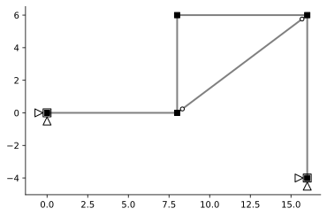

# Event to Event Analysis

(220_HW12_P2r)


```python
import ema as em
import numpy as np
# import sympy as sp
import matplotlib.pyplot as plt
%config InlineBackend.figure_format = 'svg'
```


```python
mdl = em.rModel(2,3) # reduced model in 2 dimensions with 3 dofs / node
n = mdl.dnodes
e = mdl.delems

# pre-define element properties for convenience; these can alse be assigned indiviudally.
mdl.material('default', E=1000)
mdl.xsection('default', 1e6, 50)
xt = mdl.xsection('truss', 10, 1)

mdl.node('1', 0.0, 0.0)
mdl.node('2', 8.0, 0.0)
mdl.node('3', 8.0, 6.0)
mdl.node('4', 16., 6.0)
mdl.node('5', 16., -4.)

# elements
mdl.beam('a', n['1'], n['2'], Qpl=[1e6, 120, 120])
mdl.beam('b', n['2'], n['3'], Qpl=[1e6, 120, 120])
mdl.beam('c', n['3'], n['4'], Qpl=[1e6, 120, 120])
mdl.beam('d', n['4'], n['5'], Qpl=[1e6, 180, 180])
mdl.truss('e', n['2'], n['4'], xsec=xt, Qpl=[ 30])

# Fixities
mdl.fix(n['1'], ['x', 'y', 'rz'])
mdl.fix(n['5'], ['x', 'y', 'rz'])

# Loading
n['3'].p['y'] = -30
n['3'].p['x'] =  50

mdl.DOF = mdl.numdofs()
```


```python
fig, ax = plt.subplots(1,1)
em.plot_structure(mdl, ax)
```

<!-- <matplotlib.axes._subplots.AxesSubplot at 0x1a4cfa18748> -->





```python
ee = em.Event2Event(mdl)
ee.run()
ee.lamda
```


    array([0.        , 1.26346229, 1.42471482, 1.53116075, 1.70774411,
           1.75555556])


```python
ee.Q[-1] # forces at last event
```


<table border="1" class="dataframe">
  <thead>
    <tr style="text-align: right;">
      <th></th>
      <th>$Q_{{}}$</th>
    </tr>
  </thead>
  <tbody>
    <tr>
      <th>$a_1$</th>
      <td>0.000000</td>
    </tr>
    <tr>
      <th>$a_2$</th>
      <td>120.000000</td>
    </tr>
    <tr>
      <th>$a_3$</th>
      <td>-82.666667</td>
    </tr>
    <tr>
      <th>$b_1$</th>
      <td>0.000000</td>
    </tr>
    <tr>
      <th>$b_2$</th>
      <td>82.666667</td>
    </tr>
    <tr>
      <th>$b_3$</th>
      <td>120.000000</td>
    </tr>
    <tr>
      <th>$c_1$</th>
      <td>0.000000</td>
    </tr>
    <tr>
      <th>$c_2$</th>
      <td>-120.000000</td>
    </tr>
    <tr>
      <th>$c_3$</th>
      <td>-120.000000</td>
    </tr>
    <tr>
      <th>$d_1$</th>
      <td>0.000000</td>
    </tr>
    <tr>
      <th>$d_2$</th>
      <td>120.000000</td>
    </tr>
    <tr>
      <th>$d_3$</th>
      <td>180.000000</td>
    </tr>
    <tr>
      <th>$e_1$</th>
      <td>30.000000</td>
    </tr>
  </tbody>
</table>


```python
ee.U # displacement vectors at each event
```


<div>
<style scoped>
    .dataframe tbody tr th:only-of-type {
        vertical-align: middle;
    }

    .dataframe tbody tr th {
        vertical-align: top;
    }

    .dataframe thead th {
        text-align: right;
    }
</style>
<table border="1" class="dataframe">
  <thead>
    <tr style="text-align: right;">
      <th></th>
      <th>0</th>
      <th>1</th>
      <th>2</th>
      <th>3</th>
      <th>4</th>
      <th>5</th>
    </tr>
  </thead>
  <tbody>
    <tr>
      <th>0</th>
      <td>0.0</td>
      <td>-0.016180</td>
      <td>-0.020235</td>
      <td>-0.026011</td>
      <td>-0.054760</td>
      <td>-0.068836</td>
    </tr>
    <tr>
      <th>1</th>
      <td>0.0</td>
      <td>-0.004619</td>
      <td>-0.005641</td>
      <td>-0.006943</td>
      <td>-0.013000</td>
      <td>-0.016213</td>
    </tr>
    <tr>
      <th>2</th>
      <td>0.0</td>
      <td>0.025365</td>
      <td>0.030523</td>
      <td>0.039657</td>
      <td>0.080000</td>
      <td>0.102720</td>
    </tr>
    <tr>
      <th>3</th>
      <td>0.0</td>
      <td>-0.001066</td>
      <td>-0.001211</td>
      <td>0.000051</td>
      <td>0.003645</td>
      <td>0.005404</td>
    </tr>
    <tr>
      <th>4</th>
      <td>0.0</td>
      <td>0.000290</td>
      <td>0.000409</td>
      <td>0.000051</td>
      <td>-0.006000</td>
      <td>-0.008272</td>
    </tr>
  </tbody>
</table>
</div>


