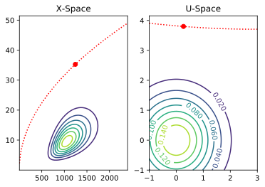

<header>

    

        
<h2 style="font-size:60px;font-weight:50 !important;"></img>anabel</h2>

        
anabel Lorem ipsum dolor sit amet, consectetur adipiscing elit, sed do eiusmod tempor incididunt ut labore et dolore magna aliqua.
    

    <a class="btn btn-outline-primary btn-lg" href="quick-start" role="button">Get Started</a>
    

    

    

</header>

<main role="main">

    

    

        

        
<a class="btn btn-outline-secondary" href="Guides/" role="button">Guides</a>

        
View guides that explain the concepts and components of <code>anabel</code>.

        
<!-- /.col-lg-4 -->

        

        
<a class="btn btn-outline-secondary" href="api/latest" role="button">API Documentation</a>

        
Peruse a comprehensive list of functions provided by<code>anabel</code>, with detailed explanations of their interfaces.

        
<!-- /.col-lg-4 -->

        

            
<a class="btn btn-outline-secondary" href="gallery/" role="button">Gallery</a>

        
Walk through some examples of the various analysis procedures that <code>anabel</code> provides.

        
<!-- /.col-lg-4 -->
    
<!-- /.row -->
    
<!-- /.row-featurette -->

<article>

    

      <h2 class="featurette-heading">Inelasticity</h2>
      
Lorem ipsum dolor sit amet, consectetur adipiscing elit, sed do eiusmod tempor incididunt ut labore et dolore magna aliqua. Ut enim ad minim veniam, quis nostrud exercitation ullamco laboris nisi ut aliquip ex ea commodo consequat.

      <!--<a class="btn btn-outline-secondary" href="Guides/Developing" role="button">Developer's Manual</a>-->
    

    

      
    

</article>

<article>

    

      
    

    

      <h2 class="featurette-heading">Partial Differential Equations</h2>
      
Lorem ipsum dolor sit amet, consectetur adipiscing elit, sed do eiusmod tempor incididunt ut labore et dolore magna aliqua. Ut enim ad minim veniam, quis nostrud exercitation ullamco laboris nisi ut aliquip ex ea commodo consequat.

      <!--<a class="btn btn-outline-secondary" href="Guides/Developing" role="button">Developer's Manual</a>-->
    

</article>

  

    <h2 class="featurette-heading">Reliability</h2>
    
Lorem ipsum dolor sit amet, consectetur adipiscing elit, sed do eiusmod tempor incididunt ut labore et dolore magna aliqua. Ut enim ad minim veniam, quis nostrud exercitation ullamco laboris nisi ut aliquip ex ea commodo consequat.

    <!-- <a class="btn btn-outline-secondary" href="Functions/latest/Utility_Functions/Plotting//Functions/latest/Utility_Functions/Plotting/" role="button">Library </a> -->
    

    

      
    

  

<!-- 

<section id="supporters">

    <h2>Acknowledgements</h2>
    
Development of <code>anabel</code> has been made possible through the following past and present supportorters:

    

    

        
    

    

        
    

    

    

    

        
    

    

        
    

    

</section> -->

<!-- 
 -->

<!-- </section> -->

</main>

<!-- <section id="ucb-fea"> -->
<!-- 

    <h3>Other UC Berkeley FEA tools</h3>
    

    

        
    

    

        
    

    

        
    

    

 -->
<!-- Code highlighting -->

<!-- Claudio Perez  -->
