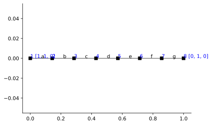
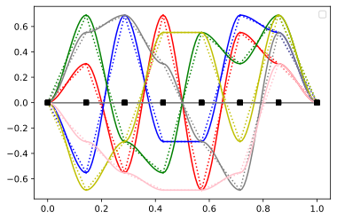

---
title: Modal Analysis - Beam
...

# Modal Analysis - Beam

```python
import emme as em
import matplotlib.pyplot as plt
import numpy as np
%config InlineBackend.figure_format = 'svg'
```


<!--# Problem 2 - Modal Analysis-->


```python
L = 1
Mass = 100
n = 8 # adjust number of nodes along beam

nf = 2+(n-2)*2
nt = 3*n-(n-1)
DOFs = [[nt-2, 0, 0] for i in range(n)]
```


```python
# Build Model
mdl = em.rModel(2,3)
nd = mdl.nodes

for i in range(n):
    if i == 0:
        mass = None
        DOFs[i][1] = nf+2
        DOFs[i][2] = nf-1
    elif i == n-1:
        mass = None
        DOFs[i][1] = nf+3
        DOFs[i][2] = nf     
    else:
        mass = Mass/(n-1)
        DOFs[i][1] = i
        DOFs[i][2] = i+(n-2)
        
    mdl.node(str(i+1), i*L/(n-1), 0.0, mass=mass)

mdl.girder(nd)

mdl.pin(nd[0])
mdl.fix(nd[-1], ['y'])

mdl.DOF = DOFs
fig, ax = plt.subplots()
em.plot_beam(mdl, ax)
```





```python
K = em.K_matrix(mdl)
M = em.Mass_matrix(mdl)
```


```python
shapes = em.analysis.ModalAnalysis(mdl)
# shapes2 = em.analysis.ModalAnalysis(mdl2)
```


```python
U = em.U_vector(em.A_matrix(mdl))
```


```python
colors = ['r', 'b', 'g', 'y','grey','pink']
# fig, ax = plt.subplots()
for i, shape in enumerate(shapes[1]):
    U[0:n-2] = shape
    em.plot_modes(mdl, U, ax, color=colors[i], label=str(i+1))
plt.legend();
```

    No handles with labels found to put in legend.
    





```python

```
