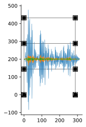

---
title: Time History Analysis - MDF Frame
...

# Time History Analysis: MDF Frame

```python
import ema as em
import matplotlib.pyplot as plt
import numpy as np
%config InlineBackend.figure_format = 'svg' # used to make plots look nicer
from ema_examples.dynamics import P09_07
from ema.utilities.ipyutils import disp_sbs
```

```python
ft = 12
h = 12*ft
m = 80/386.4
E = 29000
I = 1000
EI = E*I
RHA = False

N = I = 3
mdl = P09_07(h = h, m = m, EI = EI)
# fig, ax = plt.subplots()
# em.plot_structure(mdl, ax)
```

```python
m, k = em.Mass_matrix(mdl), em.K_matrix(mdl)
k, m = em.analysis.StaticCondensation(k, m)
disp_sbs(m.df, k.df)
```

<table style="display:inline" class="dataframe">
  <thead>
    <tr style="text-align: right;">
      <th></th>
      <th>$u_{1}$</th>
      <th>$u_{2}$</th>
      <th>$u_{3}$</th>
    </tr>
  </thead>
  <tbody>
    <tr>
      <th>$u_{1}$</th>
      <td>0.207039</td>
      <td>0.000000</td>
      <td>0.00000</td>
    </tr>
    <tr>
      <th>$u_{2}$</th>
      <td>0.000000</td>
      <td>0.207039</td>
      <td>0.00000</td>
    </tr>
    <tr>
      <th>$u_{3}$</th>
      <td>0.000000</td>
      <td>0.000000</td>
      <td>0.10352</td>
    </tr>
  </tbody>
</table><table style="display:inline" class="dataframe">
  <thead>
    <tr style="text-align: right;">
      <th></th>
      <th>$1$</th>
      <th>$2$</th>
      <th>$3$</th>
    </tr>
  </thead>
  <tbody>
    <tr>
      <th>$P_{1}$</th>
      <td>466.177984</td>
      <td>-233.088992</td>
      <td>0.000000</td>
    </tr>
    <tr>
      <th>$P_{2}$</th>
      <td>-233.088992</td>
      <td>466.177984</td>
      <td>-233.088992</td>
    </tr>
    <tr>
      <th>$P_{3}$</th>
      <td>0.000000</td>
      <td>-233.088992</td>
      <td>233.088992</td>
    </tr>
  </tbody>
</table>


The function `ema.analysis.ModalAnalysis` wraps a scipy routine for solving the eigenvalue problem.


```python
freq2, Phi = em.analysis.ModalAnalysis(mdl, norm='last')
Phi
```


    array([[ 5.00000000e-01, -1.00000000e+00,  5.00000000e-01],
           [ 8.66025404e-01,  2.28035323e-16, -8.66025404e-01],
           [ 1.00000000e+00,  1.00000000e+00,  1.00000000e+00]])


```python
omega = np.array([np.sqrt(np.real(freq)) for freq in freq2])
omega
```


    array([17.36843442, 47.45144529, 64.81987972])


```python
M = Phi.T@m@Phi
K = Phi.T@k@Phi
```

## Modal expansion of earthquake forces


$$\mathrm{p}_{\mathrm{eff}}(t)=-\mathrm{m} \iota \ddot{u}_{g}(t)$$

$$\mathbf{m} \iota=\sum_{n=1}^{N} \mathbf{s}_{n}=\sum_{n=1}^{N} \Gamma_{n} \mathbf{m} \phi_{n}$$


```python
I = N = 3
iota = np.ones(I)
L = np.array([sum(Phi.T[n,i]*sum(m[i,j]*iota[j] for j in range(I)) for i in range(I)) for n in range(N)])
L = Phi.T@m@iota
L
```


    Structural_Vector([ 0.38634066, -0.10351967,  0.02773801])


```python
gamma = np.array([L[n]/M[n,n]  for n in range(N)])
gamma
```


    array([ 1.24401694, -0.33333333,  0.0893164 ])


```python
s = np.array([gamma[n]*(m@Phi.T[n]) for n in range(N)]).T
s
```

    array([[ 1.28780221e-01,  6.90131125e-02,  9.24600388e-03],
           [ 2.23053886e-01, -1.57374274e-17, -1.60145485e-02],
           [ 1.28780221e-01, -3.45065562e-02,  9.24600388e-03]])

## a) Determine $A_n$ and $D_n$


```python
# Values read from response spectrum:
D = np.array([0.877, 0.10, 0.04]) # inches
D
```


    array([0.877, 0.1  , 0.04 ])


```python
# if RHA:
D = []
u = []
for i, w in enumerate(omega):
    zeta = 0.05
    t, d = em.analysis.ElcentroRHA(zeta, w)
    D.append(max(d))
    u.append([t,d])
print(D)
```

    [0.923352660303864, 0.09304519274915218, 0.03763691127115581]
    

Plot modes:


```python
fig2, ax2 = plt.subplots()
em.plot_structure(mdl, ax2)
for i in range(3):
    plt.plot(10*u[i][0],200+300*u[i][1], linewidth=0.5)
plt.show()
```




```python
A = np.array([D[n]*omega[n]**2 for n in range(N)])
A
```


    array([278.54088513, 209.50424621, 158.13587895])


## b) Modal response quantities

### Floor displacements


```python
Un = np.array([[gamma[n]*Phi[i,n]*D[n] for n in range(N)]for i in range(I)])
Un
```


    array([[ 5.74333174e-01,  3.10150642e-02,  1.68079666e-03],
           [ 9.94774237e-01, -7.07253019e-18, -2.91122522e-03],
           [ 1.14866635e+00, -3.10150642e-02,  3.36159333e-03]])


### Story shears


```python
Vin = np.array([[sum(s[j,n]*A[n] for j in range(i, I)) for n in range(N)] for i in range(I)])
Vin
```


    array([[133.87074037,   7.22927006,   0.3917752 ],
           [ 98.0001836 ,  -7.22927006,  -1.07034975],
           [ 35.87055677,  -7.22927006,   1.46212495]])


### Floor and base moments


```python
M_base = np.array([sum(s[i,n]*h*(i+1)*A[n]  for i in range(I)) for n in range(N)])
M_base # kip-inch
```


    array([38554.77322731, -1041.01488801,   112.8312575 ])


```python
H = [h*(i+1) for i in range(I)]
H
```


    [144, 288, 432]


```python
M_floor = np.array([[sum((H[j]-h*(i+1))*s[j,n]*A[n] for j in range(i,N)) for n in range(N)] for i in range(I)])
M_floor # kip-inch
```


    array([[19277.38661365, -2082.02977602,    56.41562875],
           [ 5165.36017531, -1041.01488801,   210.54599284],
           [    0.        ,     0.        ,     0.        ]])


## c) Peak modal response combination

For well-seperated modal frequencies, the SRSS method is employed.


```python
def ro(rno):
    return np.sqrt(sum(rn**2 for rn in rno))
```

### Floor displacements

text


```python
ro(Un.T)
```


    array([0.57517246, 0.9947785 , 1.14908991])


### Story shears


```python
ro(Vin.T)
```


    array([134.06636775,  98.27229508,  36.62099122])


### Floor and base overturning moments


```python
ro(M_base)
```


    38568.98989471707


```python
ro(M_floor)
```


    array([19957.41918167,  2327.78005518,   217.97325126])


