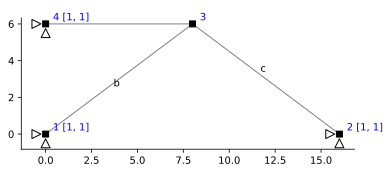

```python
import ema as em
import matplotlib.pyplot as plt
import numpy as np
import sympy as sp
%config InlineBackend.figure_format = 'svg'
```

# Problem 1


```python
dm = em.Model(2,2) # create instance of model object
n = dm.dnodes 
e = dm.delems

A1 = 10000
Ac = 20000
I = 1
dm.xsection('default', A1, I)
csec = dm.xsection('section-c', Ac, I)

n1 = dm.node('1', 0.0, 0.0)
n2 = dm.node('2', 16., 0.0)
n3 = dm.node('3', 8.0, 6.0)
n4 = dm.node('4', 0.0, 6.0)

a = dm.truss('a', n3, n4) # add truss element to model object
b = dm.truss('b', n1, n3)
c = dm.truss('c', n2, n3, xsec=csec)

dm.pin(n1)
dm.pin(n4)
dm.pin(n2)

dm.numDOF() # Automatically number model dofs

# em.utilities.export.FEDEAS(dm)
```


    [[3, 4], [5, 6], [1, 2], [7, 8]]


```python
prim = em.Model(2,2) # create instance of model object
np = prim.dnodes 
ep = prim.delems

A1 = 10000
Ac = 20000
I = 1
prim.xsection('default', A1, I)
csec = prim.xsection('section-c', Ac, I)

prim.node('1', 0.0, 0.0)
prim.node('2', 16., 0.0)
prim.node('3', 8.0, 6.0)
prim.node('4', 0.0, 6.0)

prim.truss('a', np['3'], np['4']) # add truss element to model object
prim.truss('c', np['2'], np['3'], xsec=csec)

prim.pin(np['1'])
prim.pin(np['4'])
prim.pin(np['2'])

prim.numDOF() # Automatically number model dofs

np['3'].p['x'] = 30
np['3'].p['y'] = 50
```


```python
# Establish redundant member force
dm.redundant(b, '1')
```


```python
fig, ax = plt.subplots()
em.plot_structure(dm, ax)
```





## Part 1 : Nodal Loading


```python
Ufp = em.analysis.SolveDispl(prim)
A = em.A_matrix(dm)
A.f@Ufp
```


<table border="1" class="dataframe">
  <thead>
    <tr style="text-align: right;">
      <th></th>
      <th>$V_{{fffffff}}$</th>
    </tr>
  </thead>
  <tbody>
    <tr>
      <th>$a_1$</th>
      <td>0.077333</td>
    </tr>
    <tr>
      <th>$b_1$</th>
      <td>0.165400</td>
    </tr>
    <tr>
      <th>$c_1$</th>
      <td>0.041667</td>
    </tr>
  </tbody>
</table>


```python
b.q0['1'] = 1
```


```python
Uf = em.analysis.SolveDispl(dm)
A = em.A_matrix(dm)
A.f@Uf
```


<table border="1" class="dataframe">
  <thead>
    <tr style="text-align: right;">
      <th></th>
      <th>$V_{{fffffffff}}$</th>
    </tr>
  </thead>
  <tbody>
    <tr>
      <th>$a_1$</th>
      <td>-0.000361</td>
    </tr>
    <tr>
      <th>$b_1$</th>
      <td>-0.000718</td>
    </tr>
    <tr>
      <th>$c_1$</th>
      <td>-0.000141</td>
    </tr>
  </tbody>
</table>


```python
# Create model matrices
B = em.B_matrix(dm)
P = em.P_vector(B)
```


```python
# Define nodal loading
n['3'].p['x'] = 30
n['3'].p['y'] = 50
P.set_item('1', 50)
P.set_item('2', 30)
```


```python
# Show full B matrix
B
```


<table border="1" class="dataframe">
  <thead>
    <tr style="text-align: right;">
      <th></th>
      <th>$a_1$</th>
      <th>$b_1$</th>
      <th>$c_1$</th>
    </tr>
  </thead>
  <tbody>
    <tr>
      <th>$1$</th>
      <td>1.0</td>
      <td>0.8</td>
      <td>-0.8</td>
    </tr>
    <tr>
      <th>$2$</th>
      <td>-0.0</td>
      <td>0.6</td>
      <td>0.6</td>
    </tr>
    <tr>
      <th>$3$</th>
      <td>0.0</td>
      <td>-0.8</td>
      <td>0.0</td>
    </tr>
    <tr>
      <th>$4$</th>
      <td>0.0</td>
      <td>-0.6</td>
      <td>0.0</td>
    </tr>
    <tr>
      <th>$5$</th>
      <td>0.0</td>
      <td>0.0</td>
      <td>0.8</td>
    </tr>
    <tr>
      <th>$6$</th>
      <td>0.0</td>
      <td>0.0</td>
      <td>-0.6</td>
    </tr>
    <tr>
      <th>$7$</th>
      <td>-1.0</td>
      <td>0.0</td>
      <td>0.0</td>
    </tr>
    <tr>
      <th>$8$</th>
      <td>0.0</td>
      <td>0.0</td>
      <td>0.0</td>
    </tr>
  </tbody>
</table>


```python
# Show portion of B matrix corresponding to free dofs
B.f
```


<table border="1" class="dataframe">
  <thead>
    <tr style="text-align: right;">
      <th></th>
      <th>$a_1$</th>
      <th>$b_1$</th>
      <th>$c_1$</th>
    </tr>
  </thead>
  <tbody>
    <tr>
      <th>$1$</th>
      <td>1.0</td>
      <td>0.8</td>
      <td>-0.8</td>
    </tr>
    <tr>
      <th>$2$</th>
      <td>-0.0</td>
      <td>0.6</td>
      <td>0.6</td>
    </tr>
  </tbody>
</table>


```python
# Show portion of B matrix corresponding to primary system
B.i
```


<table border="1" class="dataframe">
  <thead>
    <tr style="text-align: right;">
      <th></th>
      <th>$a_1$</th>
      <th>$c_1$</th>
    </tr>
  </thead>
  <tbody>
    <tr>
      <th>$1$</th>
      <td>1.0</td>
      <td>-0.8</td>
    </tr>
    <tr>
      <th>$2$</th>
      <td>-0.0</td>
      <td>0.6</td>
    </tr>
  </tbody>
</table>


### Find $Q_p$


```python
Qp = B.bari @ P.f
Qp
```


<table border="1" class="dataframe">
  <thead>
    <tr style="text-align: right;">
      <th></th>
      <th>$Q_{{ffffff}}$</th>
    </tr>
  </thead>
  <tbody>
    <tr>
      <th>$a_1$</th>
      <td>90.0</td>
    </tr>
    <tr>
      <th>$c_1$</th>
      <td>50.0</td>
    </tr>
  </tbody>
</table>


```python
# create full 3x1 Qp vector from current 2x1 Qp vector
Qp = em.Q_vector(B, Qp)
Qp
```


<table border="1" class="dataframe">
  <thead>
    <tr style="text-align: right;">
      <th></th>
      <th>$Q_{{0}}$</th>
    </tr>
  </thead>
  <tbody>
    <tr>
      <th>$a_1$</th>
      <td>90.0</td>
    </tr>
    <tr>
      <th>$b_1$</th>
      <td>0.0</td>
    </tr>
    <tr>
      <th>$c_1$</th>
      <td>50.0</td>
    </tr>
  </tbody>
</table>


### find $(V_h)_p$


```python
# Initialize structure matrices
A = em.A_matrix(dm)
Fs = em.Fs_matrix(dm) 
Fs
```


<table border="1" class="dataframe">
  <thead>
    <tr style="text-align: right;">
      <th></th>
      <th>$a_1$</th>
      <th>$b_1$</th>
      <th>$c_1$</th>
    </tr>
  </thead>
  <tbody>
    <tr>
      <th>$a_1$</th>
      <td>0.0008</td>
      <td>0.000</td>
      <td>0.0000</td>
    </tr>
    <tr>
      <th>$b_1$</th>
      <td>0.0000</td>
      <td>0.001</td>
      <td>0.0000</td>
    </tr>
    <tr>
      <th>$c_1$</th>
      <td>0.0000</td>
      <td>0.000</td>
      <td>0.0005</td>
    </tr>
  </tbody>
</table>


```python
Ve = Fs@Qp
Vhp = B.barx.T @ Ve
Vhp
```

    C:\Users\claud\Anaconda3\lib\site-packages\IPython\core\formatters.py:371: FormatterWarning: text/html formatter returned invalid type <class 'ema.utilities.Structural_Vector'> (expected <class 'str'>) for object: Structural_Vector([-0.1402])
      FormatterWarning
    


    Structural_Vector([-0.1402])


### find $(V_{h})_x$


```python
Ve_x = Fs@B.barx
Ve_x
```


<table border="1" class="dataframe">
  <thead>
    <tr style="text-align: right;">
      <th></th>
      <th>$b_1$</th>
    </tr>
  </thead>
  <tbody>
    <tr>
      <th>$a_1$</th>
      <td>-0.00128</td>
    </tr>
    <tr>
      <th>$b_1$</th>
      <td>0.00100</td>
    </tr>
    <tr>
      <th>$c_1$</th>
      <td>-0.00050</td>
    </tr>
  </tbody>
</table>


```python
Vhx = B.barx.T@Ve_x
Vhx
```


<table border="1" class="dataframe">
  <thead>
    <tr style="text-align: right;">
      <th></th>
      <th>0</th>
    </tr>
  </thead>
  <tbody>
    <tr>
      <th>0</th>
      <td>0.003548</td>
    </tr>
  </tbody>
</table>


```python
Qx = -Vhp/Vhx
Qx
```

    C:\Users\claud\Anaconda3\lib\site-packages\IPython\core\formatters.py:371: FormatterWarning: text/html formatter returned invalid type <class 'ema.utilities.Structural_Vector'> (expected <class 'str'>) for object: Structural_Vector([[39.51521984]])
      FormatterWarning
    


    Structural_Vector([[39.51521984]])


## Part 2 : Thermal Loading

### Find $(V_h)_p$


```python
# e['a'].e0['1'] = 100*2e-5
# e['b'].e0['1'] = 100*2e-5
# e['c'].e0['1'] = 100*2e-5
```


```python
A = em.A_matrix(dm)
A
```


<table border="1" class="dataframe">
  <thead>
    <tr style="text-align: right;">
      <th></th>
      <th>$1$</th>
      <th>$2$</th>
      <th>$3$</th>
      <th>$4$</th>
      <th>$5$</th>
      <th>$6$</th>
      <th>$7$</th>
      <th>$8$</th>
    </tr>
  </thead>
  <tbody>
    <tr>
      <th>$a_1$</th>
      <td>1.0</td>
      <td>-0.0</td>
      <td>0.0</td>
      <td>0.0</td>
      <td>0.0</td>
      <td>0.0</td>
      <td>-1.0</td>
      <td>0.0</td>
    </tr>
    <tr>
      <th>$b_1$</th>
      <td>0.8</td>
      <td>0.6</td>
      <td>-0.8</td>
      <td>-0.6</td>
      <td>0.0</td>
      <td>0.0</td>
      <td>0.0</td>
      <td>0.0</td>
    </tr>
    <tr>
      <th>$c_1$</th>
      <td>-0.8</td>
      <td>0.6</td>
      <td>0.0</td>
      <td>0.0</td>
      <td>0.8</td>
      <td>-0.6</td>
      <td>0.0</td>
      <td>0.0</td>
    </tr>
  </tbody>
</table>


```python
V0 = em.V0_vector(dm)
V0
```


<table border="1" class="dataframe">
  <thead>
    <tr style="text-align: right;">
      <th></th>
      <th>$V_{{ffffff}}$</th>
    </tr>
  </thead>
  <tbody>
    <tr>
      <th>$a_1$</th>
      <td>0.0</td>
    </tr>
    <tr>
      <th>$b_1$</th>
      <td>0.0</td>
    </tr>
    <tr>
      <th>$c_1$</th>
      <td>0.0</td>
    </tr>
  </tbody>
</table>


```python
Vhp = B.barx.T@V0
Vhp
```

    C:\Users\claud\Anaconda3\lib\site-packages\IPython\core\formatters.py:371: FormatterWarning: text/html formatter returned invalid type <class 'ema.utilities.Structural_Vector'> (expected <class 'str'>) for object: Structural_Vector([0.])
      FormatterWarning
    


    Structural_Vector([0.])


### Find $Q_x$


```python
Qx = -Vhp/Vhx
Qx
```

    C:\Users\claud\Anaconda3\lib\site-packages\IPython\core\formatters.py:371: FormatterWarning: text/html formatter returned invalid type <class 'ema.utilities.Structural_Vector'> (expected <class 'str'>) for object: Structural_Vector([[-0.]])
      FormatterWarning
    


    Structural_Vector([[-0.]])


