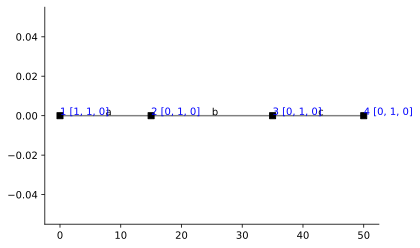

# Stiffness Method - Beam

```python
import emme as em
import matplotlib.pyplot as plt
import numpy as np
%config InlineBackend.figure_format = 'svg' # used to make plots look nicer
```


```python
# Initialize model
dm = em.Model(2,3)
nodes = dm.nodes
n = dm.dnodes

# Define section properties
A = 1
Iab = 200000
Ic  = 300000
xs1 = dm.xsec('ab', A, Iab)
xs2 = dm.xsec('c', A, Ic)

xsecs = [xs1, xs1, xs2] 

# Define nodes
dm.node('1', 0.0, 0.0)
dm.node('2', 15., 0.0)
dm.node('3', 35., 0.0)
dm.node('4', 50., 0.0)

# Create beams
a, b, c = dm.girder(nodes, xsecs=xsecs)


# Establish fixities
dm.fix(n['1'], ['x','y'])
dm.fix(n['2'], ['y'])
dm.fix(n['3'], ['y'])
dm.fix(n['4'], ['y'])

# uncomment line below to automatically print FEDEASLab input script
# em.utilities.export.FEDEAS(dm)

dm.numDOF() # automatically number dofs and print them as list
```


    [[8, 9, 1], [2, 10, 3], [4, 11, 5], [6, 12, 7]]


```python
fig, ax = plt.subplots()
em.plot_beam(dm, ax)
```





## Part a) Distributed Loading

### Determine displacements of the free dofs.


```python
# set element loads
a.w['y'] = -10
b.w['y'] = -10
```


```python
A = em.A_matrix(dm)
B = em.B_matrix(dm)
V0 = em.V_vector(A).o
```


```python
Q0 = em.Q_vector(B).o
Q0
```


<table border="1" class="dataframe">
  <thead>
    <tr style="text-align: right;">
      <th></th>
      <th>$Q_{{}}$</th>
    </tr>
  </thead>
  <tbody>
    <tr>
      <th>$a_1$</th>
      <td>0.000000</td>
    </tr>
    <tr>
      <th>$a_2$</th>
      <td>187.500000</td>
    </tr>
    <tr>
      <th>$a_3$</th>
      <td>-187.500000</td>
    </tr>
    <tr>
      <th>$b_1$</th>
      <td>0.000000</td>
    </tr>
    <tr>
      <th>$b_2$</th>
      <td>333.333333</td>
    </tr>
    <tr>
      <th>$b_3$</th>
      <td>-333.333333</td>
    </tr>
    <tr>
      <th>$c_1$</th>
      <td>0.000000</td>
    </tr>
    <tr>
      <th>$c_2$</th>
      <td>0.000000</td>
    </tr>
    <tr>
      <th>$c_3$</th>
      <td>0.000000</td>
    </tr>
  </tbody>
</table>


```python
P0 = B.f@Q0
P0
```


<table border="1" class="dataframe">
  <thead>
    <tr style="text-align: right;">
      <th></th>
      <th>$P_{{}}$</th>
    </tr>
  </thead>
  <tbody>
    <tr>
      <th>$1$</th>
      <td>187.500000</td>
    </tr>
    <tr>
      <th>$2$</th>
      <td>0.000000</td>
    </tr>
    <tr>
      <th>$3$</th>
      <td>145.833333</td>
    </tr>
    <tr>
      <th>$4$</th>
      <td>0.000000</td>
    </tr>
    <tr>
      <th>$5$</th>
      <td>-333.333333</td>
    </tr>
    <tr>
      <th>$6$</th>
      <td>0.000000</td>
    </tr>
    <tr>
      <th>$7$</th>
      <td>0.000000</td>
    </tr>
  </tbody>
</table>


```python
K = em.K_matrix(dm)
K.f
```


<table border="1" class="dataframe">
  <thead>
    <tr style="text-align: right;">
      <th></th>
      <th>$U_{{1}}$</th>
      <th>$U_{{2}}$</th>
      <th>$U_{{3}}$</th>
      <th>$U_{{4}}$</th>
      <th>$U_{{5}}$</th>
      <th>$U_{{6}}$</th>
      <th>$U_{{7}}$</th>
    </tr>
  </thead>
  <tbody>
    <tr>
      <th>$P_{{1}}$</th>
      <td>53333.333333</td>
      <td>0.000000</td>
      <td>26666.666667</td>
      <td>0.000000</td>
      <td>0.0</td>
      <td>0.000000</td>
      <td>0.0</td>
    </tr>
    <tr>
      <th>$P_{{2}}$</th>
      <td>0.000000</td>
      <td>0.116667</td>
      <td>0.000000</td>
      <td>-0.050000</td>
      <td>0.0</td>
      <td>0.000000</td>
      <td>0.0</td>
    </tr>
    <tr>
      <th>$P_{{3}}$</th>
      <td>26666.666667</td>
      <td>0.000000</td>
      <td>93333.333333</td>
      <td>0.000000</td>
      <td>20000.0</td>
      <td>0.000000</td>
      <td>0.0</td>
    </tr>
    <tr>
      <th>$P_{{4}}$</th>
      <td>0.000000</td>
      <td>-0.050000</td>
      <td>0.000000</td>
      <td>0.116667</td>
      <td>0.0</td>
      <td>-0.066667</td>
      <td>0.0</td>
    </tr>
    <tr>
      <th>$P_{{5}}$</th>
      <td>0.000000</td>
      <td>0.000000</td>
      <td>20000.000000</td>
      <td>0.000000</td>
      <td>120000.0</td>
      <td>0.000000</td>
      <td>40000.0</td>
    </tr>
    <tr>
      <th>$P_{{6}}$</th>
      <td>0.000000</td>
      <td>0.000000</td>
      <td>0.000000</td>
      <td>-0.066667</td>
      <td>0.0</td>
      <td>0.066667</td>
      <td>0.0</td>
    </tr>
    <tr>
      <th>$P_{{7}}$</th>
      <td>0.000000</td>
      <td>0.000000</td>
      <td>0.000000</td>
      <td>0.000000</td>
      <td>40000.0</td>
      <td>0.000000</td>
      <td>80000.0</td>
    </tr>
  </tbody>
</table>


```python
Uf = K.f.inv@(-P0)
Uf
```


<table border="1" class="dataframe">
  <thead>
    <tr style="text-align: right;">
      <th></th>
      <th>$U_{{}}$</th>
    </tr>
  </thead>
  <tbody>
    <tr>
      <th>$U_{{1}}$</th>
      <td>-0.002734</td>
    </tr>
    <tr>
      <th>$U_{{2}}$</th>
      <td>0.000000</td>
    </tr>
    <tr>
      <th>$U_{{3}}$</th>
      <td>-0.001562</td>
    </tr>
    <tr>
      <th>$U_{{4}}$</th>
      <td>0.000000</td>
    </tr>
    <tr>
      <th>$U_{{5}}$</th>
      <td>0.003646</td>
    </tr>
    <tr>
      <th>$U_{{6}}$</th>
      <td>0.000000</td>
    </tr>
    <tr>
      <th>$U_{{7}}$</th>
      <td>-0.001823</td>
    </tr>
  </tbody>
</table>


### Determine element basic forces


```python
V = A.f@Uf
V
```


<table border="1" class="dataframe">
  <thead>
    <tr style="text-align: right;">
      <th></th>
      <th>$V_{{}}$</th>
    </tr>
  </thead>
  <tbody>
    <tr>
      <th>$a_1$</th>
      <td>0.000000</td>
    </tr>
    <tr>
      <th>$a_2$</th>
      <td>-0.002734</td>
    </tr>
    <tr>
      <th>$a_3$</th>
      <td>-0.001562</td>
    </tr>
    <tr>
      <th>$b_1$</th>
      <td>0.000000</td>
    </tr>
    <tr>
      <th>$b_2$</th>
      <td>-0.001562</td>
    </tr>
    <tr>
      <th>$b_3$</th>
      <td>0.003646</td>
    </tr>
    <tr>
      <th>$c_1$</th>
      <td>0.000000</td>
    </tr>
    <tr>
      <th>$c_2$</th>
      <td>0.003646</td>
    </tr>
    <tr>
      <th>$c_3$</th>
      <td>-0.001823</td>
    </tr>
  </tbody>
</table>


```python
Q = K.s@ V+Q0
Q
```


<table border="1" class="dataframe">
  <thead>
    <tr style="text-align: right;">
      <th></th>
      <th>0</th>
    </tr>
  </thead>
  <tbody>
    <tr>
      <th>0</th>
      <td>0.000000e+00</td>
    </tr>
    <tr>
      <th>1</th>
      <td>2.842171e-14</td>
    </tr>
    <tr>
      <th>2</th>
      <td>-3.437500e+02</td>
    </tr>
    <tr>
      <th>3</th>
      <td>0.000000e+00</td>
    </tr>
    <tr>
      <th>4</th>
      <td>3.437500e+02</td>
    </tr>
    <tr>
      <th>5</th>
      <td>-2.187500e+02</td>
    </tr>
    <tr>
      <th>6</th>
      <td>0.000000e+00</td>
    </tr>
    <tr>
      <th>7</th>
      <td>2.187500e+02</td>
    </tr>
    <tr>
      <th>8</th>
      <td>2.842171e-14</td>
    </tr>
  </tbody>
</table>


## Part b) Thermal Loading


```python
a.w['y'] = 0.0
b.w['y'] = 0.0
b.e0['2'] = -1e-3
b.e0['3'] =  1e-3
c.e0['2'] = -1e-3
c.e0['3'] =  1e-3
```


```python
V0 = em.V_vector(A).o
V0
```


<table border="1" class="dataframe">
  <thead>
    <tr style="text-align: right;">
      <th></th>
      <th>$V_{{0}}$</th>
    </tr>
  </thead>
  <tbody>
    <tr>
      <th>$a_1$</th>
      <td>0.0000</td>
    </tr>
    <tr>
      <th>$a_2$</th>
      <td>0.0000</td>
    </tr>
    <tr>
      <th>$a_3$</th>
      <td>0.0000</td>
    </tr>
    <tr>
      <th>$b_1$</th>
      <td>0.0000</td>
    </tr>
    <tr>
      <th>$b_2$</th>
      <td>0.0100</td>
    </tr>
    <tr>
      <th>$b_3$</th>
      <td>-0.0100</td>
    </tr>
    <tr>
      <th>$c_1$</th>
      <td>0.0000</td>
    </tr>
    <tr>
      <th>$c_2$</th>
      <td>0.0075</td>
    </tr>
    <tr>
      <th>$c_3$</th>
      <td>-0.0075</td>
    </tr>
  </tbody>
</table>


```python
Q0 = em.Q_vector(B).o
Q0
```


<table border="1" class="dataframe">
  <thead>
    <tr style="text-align: right;">
      <th></th>
      <th>$Q_{{}}$</th>
    </tr>
  </thead>
  <tbody>
    <tr>
      <th>$a_1$</th>
      <td>0.0</td>
    </tr>
    <tr>
      <th>$a_2$</th>
      <td>0.0</td>
    </tr>
    <tr>
      <th>$a_3$</th>
      <td>0.0</td>
    </tr>
    <tr>
      <th>$b_1$</th>
      <td>0.0</td>
    </tr>
    <tr>
      <th>$b_2$</th>
      <td>-200.0</td>
    </tr>
    <tr>
      <th>$b_3$</th>
      <td>200.0</td>
    </tr>
    <tr>
      <th>$c_1$</th>
      <td>0.0</td>
    </tr>
    <tr>
      <th>$c_2$</th>
      <td>-300.0</td>
    </tr>
    <tr>
      <th>$c_3$</th>
      <td>300.0</td>
    </tr>
  </tbody>
</table>


```python
c.f_matrix()
```


<table border="1" class="dataframe">
  <thead>
    <tr style="text-align: right;">
      <th></th>
      <th>$q_1$</th>
      <th>$q_2$</th>
      <th>$q_3$</th>
    </tr>
  </thead>
  <tbody>
    <tr>
      <th>$v_1$</th>
      <td>15.0</td>
      <td>0.000000</td>
      <td>0.000000</td>
    </tr>
    <tr>
      <th>$v_2$</th>
      <td>0.0</td>
      <td>0.000017</td>
      <td>-0.000008</td>
    </tr>
    <tr>
      <th>$v_3$</th>
      <td>0.0</td>
      <td>-0.000008</td>
      <td>0.000017</td>
    </tr>
  </tbody>
</table>


```python

```
