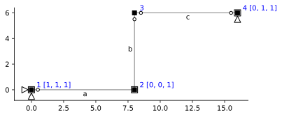
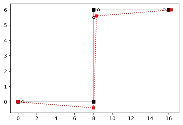

# Problem 2

(See also HW-07 Problem 1)

```python
import emme as em
import matplotlib.pyplot as plt
import numpy as np
%config InlineBackend.figure_format = 'svg' # used to make plots look nicerbb
```


```python
#Remove
mdl = em.rModel(2,3)
n = mdl.dnodes
e = mdl.delems

mdl.node('1',  0.0, 0.0)
mdl.node('2',  8.0, 0.0)
mdl.node('3',  8.0, 6.0)
mdl.node('4', 16.0, 6.0)

mdl.beam('a', n['1'], n['2'])
mdl.beam('b', n['2'], n['3'])
mdl.beam('c', n['3'], n['4'])

mdl.hinge(e['a'], n['1'])
mdl.hinge(e['b'], n['3'])
mdl.hinge(e['c'], n['3'])
mdl.hinge(e['c'], n['4'])

mdl.fix(n['1'], ['x', 'y', 'rz'])
mdl.fix(n['2'], ['rz'])
mdl.fix(n['4'], ['y', 'rz'])

# mdl.numDOF()
mdl.DOF = [[4, 5, 6], [4, 1, 2], [3, 1, 7], [3, 8, 9]]
em.analysis.characterize(mdl)
```

    m = 1
    s = 0
    


```python
fig, ax = plt.subplots()
em.plot_structure(mdl, ax)
```





```python
A = em.A_matrix(mdl).remove('frame-axial')
A.c
```


<table border="1" class="dataframe">
  <thead>
    <tr style="text-align: right;">
      <th></th>
      <th>$1$</th>
      <th>$2$</th>
      <th>$3$</th>
    </tr>
  </thead>
  <tbody>
    <tr>
      <th>$a_3$</th>
      <td>-0.125</td>
      <td>1.0</td>
      <td>0.000000</td>
    </tr>
    <tr>
      <th>$b_2$</th>
      <td>-0.000</td>
      <td>1.0</td>
      <td>0.166667</td>
    </tr>
  </tbody>
</table>


```python
ker = A.c.ker 
A_cm = ker/ker[0]
A_cm
```


<table border="1" class="dataframe">
  <thead>
    <tr style="text-align: right;">
      <th></th>
      <th>0</th>
    </tr>
  </thead>
  <tbody>
    <tr>
      <th>0</th>
      <td>1.000</td>
    </tr>
    <tr>
      <th>1</th>
      <td>0.125</td>
    </tr>
    <tr>
      <th>2</th>
      <td>-0.750</td>
    </tr>
  </tbody>
</table>


```python
em.plot_U(mdl, ker, ax, scale=0.5)
```





```python
A.f@A_cm
```


<table border="1" class="dataframe">
  <thead>
    <tr style="text-align: right;">
      <th></th>
      <th>0</th>
    </tr>
  </thead>
  <tbody>
    <tr>
      <th>0</th>
      <td>-1.250000e-01</td>
    </tr>
    <tr>
      <th>1</th>
      <td>-1.804112e-16</td>
    </tr>
    <tr>
      <th>2</th>
      <td>-4.394633e-17</td>
    </tr>
    <tr>
      <th>3</th>
      <td>-1.250000e-01</td>
    </tr>
    <tr>
      <th>4</th>
      <td>1.250000e-01</td>
    </tr>
    <tr>
      <th>5</th>
      <td>1.250000e-01</td>
    </tr>
  </tbody>
</table>


```python

```
