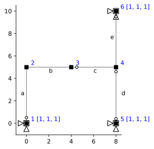
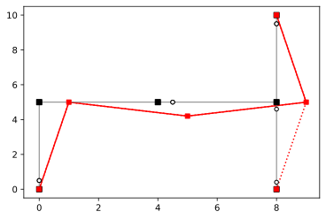

# Kinematics

```python
import emme as em
import matplotlib.pyplot as plt
import numpy as np
import sympy as sp
%config InlineBackend.figure_format = 'svg'
import scipy.linalg as la
```

```python
mdl = em.Model(2,3)
n = mdl.dnodes
e = mdl.delems

mdl.node('1', 0.0, 0.0)
mdl.node('2', 0.0, 5.0)
mdl.node('3', 4.0, 5.0)
mdl.node('4', 8.0, 5.0)
mdl.node('5', 8.0, 0.0)
mdl.node('6', 8.0, 10.)

mdl.beam('a', n['1'], n['2'])
mdl.beam('b', n['2'], n['3'])
mdl.beam('c', n['3'], n['4'])
mdl.truss('d', n['4'], n['5'])
mdl.beam('e', n['4'], n['6'])

mdl.hinge(e['a'], n['1'])
mdl.hinge(e['c'], n['3'])
mdl.hinge(e['e'], n['6'])

mdl.fix(n['1'], ['x','y','rz'])
mdl.fix(n['5'], ['x','y','rz'])
mdl.fix(n['6'], ['x','y','rz'])

mdl.numDOF()
em.analysis.characterize(mdl)
```

    m = 1
    s = 2
    


```python
fig, ax = plt.subplots()
em.plot_structure(mdl, ax)
```





```python
A = em.A_matrix(mdl)
A.f
```


<table border="1" class="dataframe">
  <thead>
    <tr style="text-align: right;">
      <th></th>
      <th>$1$</th>
      <th>$2$</th>
      <th>$3$</th>
      <th>$4$</th>
      <th>$5$</th>
      <th>$6$</th>
      <th>$7$</th>
      <th>$8$</th>
      <th>$9$</th>
    </tr>
  </thead>
  <tbody>
    <tr>
      <th>$a_1$</th>
      <td>0.0</td>
      <td>1.00</td>
      <td>0.0</td>
      <td>0.0</td>
      <td>0.00</td>
      <td>0.0</td>
      <td>0.0</td>
      <td>0.00</td>
      <td>0.0</td>
    </tr>
    <tr>
      <th>$a_2$</th>
      <td>0.2</td>
      <td>-0.00</td>
      <td>0.0</td>
      <td>0.0</td>
      <td>0.00</td>
      <td>0.0</td>
      <td>0.0</td>
      <td>0.00</td>
      <td>0.0</td>
    </tr>
    <tr>
      <th>$a_3$</th>
      <td>0.2</td>
      <td>-0.00</td>
      <td>1.0</td>
      <td>0.0</td>
      <td>0.00</td>
      <td>0.0</td>
      <td>0.0</td>
      <td>0.00</td>
      <td>0.0</td>
    </tr>
    <tr>
      <th>$b_1$</th>
      <td>-1.0</td>
      <td>-0.00</td>
      <td>0.0</td>
      <td>1.0</td>
      <td>0.00</td>
      <td>0.0</td>
      <td>0.0</td>
      <td>0.00</td>
      <td>0.0</td>
    </tr>
    <tr>
      <th>$b_2$</th>
      <td>-0.0</td>
      <td>0.25</td>
      <td>1.0</td>
      <td>0.0</td>
      <td>-0.25</td>
      <td>0.0</td>
      <td>0.0</td>
      <td>0.00</td>
      <td>0.0</td>
    </tr>
    <tr>
      <th>$b_3$</th>
      <td>-0.0</td>
      <td>0.25</td>
      <td>0.0</td>
      <td>0.0</td>
      <td>-0.25</td>
      <td>1.0</td>
      <td>0.0</td>
      <td>0.00</td>
      <td>0.0</td>
    </tr>
    <tr>
      <th>$c_1$</th>
      <td>0.0</td>
      <td>0.00</td>
      <td>0.0</td>
      <td>-1.0</td>
      <td>-0.00</td>
      <td>0.0</td>
      <td>1.0</td>
      <td>0.00</td>
      <td>0.0</td>
    </tr>
    <tr>
      <th>$c_2$</th>
      <td>0.0</td>
      <td>0.00</td>
      <td>0.0</td>
      <td>-0.0</td>
      <td>0.25</td>
      <td>1.0</td>
      <td>0.0</td>
      <td>-0.25</td>
      <td>0.0</td>
    </tr>
    <tr>
      <th>$c_3$</th>
      <td>0.0</td>
      <td>0.00</td>
      <td>0.0</td>
      <td>-0.0</td>
      <td>0.25</td>
      <td>0.0</td>
      <td>0.0</td>
      <td>-0.25</td>
      <td>1.0</td>
    </tr>
    <tr>
      <th>$d_1$</th>
      <td>0.0</td>
      <td>0.00</td>
      <td>0.0</td>
      <td>0.0</td>
      <td>0.00</td>
      <td>0.0</td>
      <td>-0.0</td>
      <td>1.00</td>
      <td>0.0</td>
    </tr>
    <tr>
      <th>$e_1$</th>
      <td>0.0</td>
      <td>0.00</td>
      <td>0.0</td>
      <td>0.0</td>
      <td>0.00</td>
      <td>0.0</td>
      <td>-0.0</td>
      <td>-1.00</td>
      <td>0.0</td>
    </tr>
    <tr>
      <th>$e_2$</th>
      <td>0.0</td>
      <td>0.00</td>
      <td>0.0</td>
      <td>0.0</td>
      <td>0.00</td>
      <td>0.0</td>
      <td>-0.2</td>
      <td>0.00</td>
      <td>1.0</td>
    </tr>
    <tr>
      <th>$e_3$</th>
      <td>0.0</td>
      <td>0.00</td>
      <td>0.0</td>
      <td>0.0</td>
      <td>0.00</td>
      <td>0.0</td>
      <td>-0.2</td>
      <td>0.00</td>
      <td>0.0</td>
    </tr>
  </tbody>
</table>


```python
ker = A.c.ker
ker = ker.round(6)/ker[0]
ker
```


<table border="1" class="dataframe">
  <thead>
    <tr style="text-align: right;">
      <th></th>
      <th>$1$</th>
    </tr>
  </thead>
  <tbody>
    <tr>
      <th>$1$</th>
      <td>1.000001</td>
    </tr>
    <tr>
      <th>$2$</th>
      <td>-0.000000</td>
    </tr>
    <tr>
      <th>$3$</th>
      <td>-0.200000</td>
    </tr>
    <tr>
      <th>$4$</th>
      <td>1.000001</td>
    </tr>
    <tr>
      <th>$5$</th>
      <td>-0.799999</td>
    </tr>
    <tr>
      <th>$6$</th>
      <td>-0.200000</td>
    </tr>
    <tr>
      <th>$7$</th>
      <td>1.000001</td>
    </tr>
    <tr>
      <th>$8$</th>
      <td>0.000000</td>
    </tr>
    <tr>
      <th>$9$</th>
      <td>0.200000</td>
    </tr>
  </tbody>
</table>


```python
em.plot_U(mdl, ker, ax, scale=1)
```




